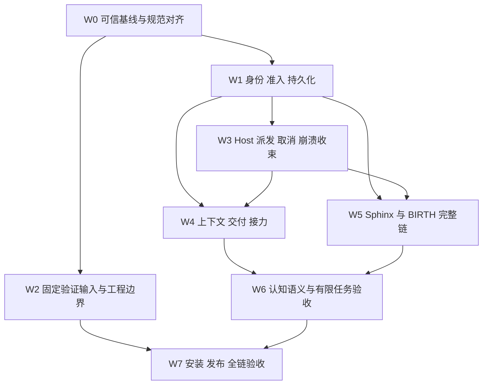

# 剩余 TODO 施工总计划（2026-10-03）

2026-10-10 四小时施工已开始，窗口 07:51:02—11:51:02 UTC。S0/WP-042 局部已证：CI 独立显式准备合同、真实 clean 丢失红/full正控、修后两夹具保留/回滚、全仓 gen381 clean、静态/格式、独立评审及gen382相邻17文件407/0、31 skip/10 TODO仅pending；首沙箱失败保留，精确提交CI待验，完整generated lineage/GAP-145及release仍开放。S1a已从实际Host取得HumanRoot首确认后cursor2无声明反例，主Manager未进入，开始两段精确身份组合证明。详见[施工记录](Upstream四小时施工-2026-10-10.md)。

2026-10-10 upstream `2575c5baa` 已合并至 `88c5b8e9e`。接手顺序由[后续施工计划](Upstream-2575后续施工计划-2026-10-10.md)接续：先 S0 包络的干净构建交付，再真实退休/待办/通知链、现布局性能与发布吞吐，随后按独立合同接续 J3/D0-R/K1 剩余叶及 MCP Sphinx 首答案。合并提交[精确 CI](archive/2026-10-10/baselines/upstream-2575-ci/receipt.md)失败于 build 缺少 LoopDetectorEnvelope，Fable/format/check 通过，测试阶段未进入；不能与旧 300s 截断混为同一问题。较新 upstream 实现和后续验收覆盖了其早期 checkpoint 的“未完成”状态，不按旧 42 卡全部重做。下方 K1/R20 等有限证明及剩余边界保留，完整 release 的新计数仍待实际取得。

当前状态：K1-A/K1-F四叶、R18/R19及R20有限闭环保持，不重复施工。新干净source candidate `65a70d0fd4c4`的原预算全项目验收已执行，结论FAILED，gen375；本机unit824/824、4971pass/0fail/127skip/388TODO仅pending，独立integration43/44原300s截断、四计数unknown，独立harness292pass/0fail及真实E2E35pass/0fail/0skip/0TODO、真实package通过。六physical合跑6entered/5父终局后原300s截断，第6父单独有限5pass/0fail/0skip/0TODO，不拼全integration绿。精确CI37783171051原300s只539/824、2active/283queued，四计数unknown。537个共同完整成本显示广泛增长且runner image/provisioner不同，尚未证明具体产品冗余或唯一环境原因；最后活动participant008/009不作根因。后续只据可执行因果证据处理剩余吞吐，不改预算/并发/tier求绿。完整矩阵见[65a记录](K1A与全项目release验收-2026-10-08.md#r2165a冻结输入的完整执行与剩余截断)；最终docs-only提交CI按实际SHA单独核查并由交付链接给出，不借65a或8d0。opening append换Root未正式证明、388TODO/skip、GAP及稳定吞吐unknown继续保留。下方均历史阶段。

## 当前执行计划（2026-10-08，K1-A有限闭环与全项目release接续）

历史阶段R18（gen363–368；后续有限结算见最上方）：R17的Assessment交错已接续到真实Change续行绕过退休中断边界，正式relay-retirement008旧实现6tests、4pass/1fail/0cancel/0skip/1TODO、3446.278833ms准确证明send先于interrupt。实现将Change与transform接入同一SharedState exact-cut一次stop及串行after，后继opening由Manager唯一路径负责，Change只回读精确nextId已committed。首Fable编译失败及gen364/365正式008两次1pass/0fail/8cancel/0skip/1TODO原件保留；撤去与实际Host child仍live不合的新增session.deleted仿真，保UUID和原断言。gen366 freshHumanRoot晚到旧transform正式红0pass/1fail/0cancel/0skip/0TODO、1576.741292ms证明EMR-010先于RelayProjection。精确退休请求前置拦截与stop/after原Root核对修正后，又因normalTransform泛型与签名不合编译失败；显式typed修正后gen367构建成功，完整008为9pass/0fail/0cancel/0skip/1TODO、6805.801416ms、exit0，仅该文件有限绿。同gen367二窗口定点1pass复用同一stop cache，不授cold guard证明；gen368已拆为独立Plugin/session、各自未有stop cache的两fixture，正式定点1pass/0fail/0cancel/0skip/0TODO、2264.682041ms、exit0，有限证明两窗口。opening append期间Root换任仍无正式证明，不按revision相等替代Root判定。本阶段普通managed缺lease控制、相关套件和真实E2E的待验状态由gen370/372接续；完整release和精确SHA CI仍pending。详见[验收记录R18](K1A与全项目release验收-2026-10-08.md#r18change与transform共享退休中断边界施工中尚未验收)。

历史阶段R17与Assessment交错调查：旧MCP presence前提违反未知工具默认deny，已由真实ManagedAgentConfig/registered Host hooks正式红gen361（32pass/1fail/1skip/0TODO）和独立连接/权限边界绿gen362（014/015+capability007，43pass/0fail/1skip/0TODO）有限修正，未放开生产权限。gen363真实E2E在更早的主Road AssessmentCommitted gte2实际1失败（34pass/1fail/0skip/0TODO、wall76.813s、exit1、输入前后相同）；该屏障与此前主flow不在R17改动内。当时根因未定、实际MCP custom not-run、GET /mcp状态unknown，同文件受控输出不代替实际Host收据。后续由R18正式退休中断证明及gen370/372真实E2E接续，不按本历史段重复认领或放开Manager权限。完整矩阵见[验收记录R17](K1A与全项目release验收-2026-10-08.md#r17mcp连接与未知工具权限边界有限修复主流程新失败未闭合)。

历史阶段R16：K1-A六项与K1-F四叶保持有限完成；ddb完整本机unit556/824和integration43/44原300s截断，真实package通过、E2E失败，精确ddb CI824/824仍128skip/388TODO、pending失败，均已封口。R13停止边界、R14顶层事件/cold、R15实际HTTP provider身份已取得正式反例和有限修复；gen351相关选集为270pass/0fail/1skip/8TODO。R16同模型preFlow窗口、逐决策容量/原Root计数及协议字段所有权已由正式红接续至gen356的014/015：34pass/0fail/1skip/0TODO；首轮10项失败、两个leg反例及internal/lane前提失败均保留。后继same-model正式红gen357为28pass/1fail/1skip、green358为35pass/0fail/1skip；Replica投影与SSE取消正式红gen359为29pass/2fail/1skip、green360为37pass/0fail/1skip，四次均0TODO。实际r16-root-protocol-e2e为31pass/1fail/0skip/0TODO、17.710s，已越过两Bound及Replica[1,2]/原Root owner[3,4]，在MCP fixture工具缺失断言失败，后续same-model/purpose/capacity customs未执行。该失败由R17–R19接续，最终新输入全项目及精确SHA CI仍待执行，不能借ddb或局部绿授最终验收。详细矩阵见[本轮记录](K1A与全项目release验收-2026-10-08.md)。

2026-10-08后续验收施工：R8已将Road/原Work/参数oracle按真实身份补正式红绿；R9实际Host父进程终止残留已正式红绿，最终006为63/63，harness为292/292（skip/TODO unknown）。R10显式失效Accepted续行、旧cut自动Continue-only与先判cut再opening已组合通过六包331pass/0fail/13skip/51TODO；不代表完整Host。R11仅减少显式SDK归档重复准备，不授吞吐闭合。R12实际公开Join正文后的NUL+BOM指导已正式红绿；R13后继真实预验的strength失败另记，不能用R12局部绿覆盖。最终冻结输入、统一release、独立补跑与该提交CI必须各有收据。以上状态与剩余边界以[验收记录](K1A与全项目release验收-2026-10-08.md)为准；下面8d3是历史完整输入，不借给后继提交。

2026-10-08 review接手：K1-A与K1-F四叶同key再入有限闭环，正式红绿及真实linked worktree负控见[K1AF卡](U0-A1-Casebook-K1AF施工卡-2026-10-08.md)和[完整release记录](K1A与全项目release验收-2026-10-08.md)。历史8d3本地统一unit824/824、4919pass/0fail/126skip/388TODO仅pending；精确官方CI37738719900也824/824、4918/0/127skip/388TODO，仅pending，不借一次完成授稳定吞吐。222官方627/824原300s截断与MSBuild原因unknown仍保留。8d3独立integration30/44截断、active2/queued12、四计数unknown，内层termination真实失败；12文件补跑124/0/0skip/2TODO不拼成全量绿。仅8d3该输入的package真实通过。R4真实消费者已越过ENOBUFS，末两Fable/readonly body与13项只读helper另有限完成；一次辅助脚本CLI整文件180s取消仍保留，恢复原无filetimeout规则不改300s预算。R5/R6 Replica/owner旧scenario已局部红绿；当时IncumbencyOpened跨Road全局计数失配由后续R8按真实Road身份修正，不能继续当作当前待施工项。四项append夹具与Blogger旧前缀此前已修；不重做忙碌resume隔离，不改pending、预算、tier或skip以求绿。下面旧“下一”由此状态覆盖。

2026-10-08接续：Journal J2、W1、G1、D0-P、K1-V、D0-G及N00正常残留负控已有限完成。K1-A路径别名及K1-F四叶同key再入也已有限完成，不重复施工；先完成本轮最终输入的全项目验收与失败处理，再从剩余队列认领。D0-R先定原shared Store接缝/身份合同；K1-F的Unknown再入、双waiter throwing须单独取证。J3须另完整窗口原子迁移，已补串行拒绝与同步Release风险及八叶矩阵，不能只加纯类型。公开plugin仍缺attached同步工具自然入口，fork不能替代。接手时只按下表选下一包；下面“下一”仅保历史，已完成有限包不得重复认领。

| 顺序 | 工作包 | 开始前的前提和验收边界 |
| --- | --- | --- |
| 有限完成，勿重做 | W1：真实Node/npm归档流式输出 | 从7a8c21c74接手，见[本包](W1工具归档流式输出-2026-10-07.md)。gen295完整016单次288pass/0fail/19skip/2TODO，1/1排空，前后输入一致。每次真实变异仍新archive，未缓存owner/归档、删负控或改预算；Darwin wall不授Linux全量300s闭合。 |
| 有限完成，勿重做 | G1：原Journal BlobWriter payload锁错误独立证明 | 从766044391接手，见[G0/G1记录](U0-GateAcquire错误分流-2026-10-07.md)。gen297完整相关41/41、287pass/0fail/14skip/15TODO，仅pending，native四叶4/0；保string合同、非空旧payload/Current/事实/head/bytes、零新init/Append及独立cold。已有保护无业务红；Git hook/持续争用仍未验收。 |
| 下个完整窗口，合同整体迁移 | Journal J3：mandatory typed capability与同incident guard | 按[详细施工卡](U0-A1-Journal-J3施工卡-2026-10-07.md)，先实际fatal-return业务红，再原writer required callback、纯typed settlement、12 factory全迁移与fatal inventory原子接续；同时处理serial派生unhandled与同步Release丢拒绝，queued/ReleaseAsync保同incident或原sentinel。八actual叶+pure/flat/native全矩阵；不得半迁移或用optional缩时间。 |
| 有限完成，勿重做 | K2-D0-P：真实attached工作前提 | [前提卡](U0-A1-SessionDeleted前提-2026-10-07.md)保gen301有限61/61、377pass/0fail/4skip/33TODO及native1/0；唯一原Scope、实际terminal/payload/draft。另保gen300清单错误、Host023普通失败与gen301大选集155/195静默截断/ownedcapture失败，不称完整Host绿。 |
| 有限完成，勿重做 | K1-V：空Cuts Unknown双waiter对照 | [原卡](U0-A1-Casebook消费者-2026-10-07.md)保gen303正式41/41、289pass/0fail/4skip/24TODO，仅pending，native1/0；真实Unknown空Cuts、一次Refresh、hot旧案/cold合法推进、零fatal/Access。生产未改，无虚假业务红。 |
| 有限完成，完整release另记 | K1-A：工作区路径别名 | [详细卡](U0-A1-Casebook-K1AF施工卡-2026-10-08.md)保gen316正式红与gen319完整相关33/33、221/0/0skip/19TODO，仅pending；key/marker/diff同physical root，先绑定再acquire，保同Store/owner及真实linked worktree。完整Host/GAP-160未闭合。 |
| 四叶有限完成 | K1-F：原拒绝后同key/同Store再入 | 同卡成功/普通observer异常/fatal返回或抛错四叶，前后同exact rawkey/同实际Store，第二实际合法Access/newEventId，保Q&A/双基线和独立cold，允许accessOrder推进。原finally已有保护；Unknown和双waiter throwing仍独立保留。 |
| 有限完成，勿重做 | K2-D0-G：原删除合法归档与dispose等待 | [原卡](U0-A1-SessionDeleted前提-2026-10-07.md)保gen305完整相关61/61、379pass/0fail/4skip/33TODO，仅pending；原事件/Bookkeeper/Capture/index及独立cold。gen306去owned drain await变异明确pending断言红、正常退出1；原字节恢复gen307 native1/0。生产未改，不授完整身份/Host。 |
| 下一有限裁决 | K2-D0-R：原删除cut拒绝接缝与取证身份 | 按[详细卡](U0-A1-SessionDeleted-D0R施工卡-2026-10-08.md)先定首次唯一shared entry的受控Append装配及managed022身份合同。四叶区分Release后Current已commit与pre-Current Unknown；原fixture抑制fatal只证后台拒绝，不授physical kill/最后writer引用/private叶回收。仅审计未实现，不借另一Store或D0-G正控授完整验收。 |
| 有限完成，勿重做 | N00：正常退出同组残留负控 | [有限卡](N00正常退出残留负控-2026-10-07.md)保gen309相关6/6、131pass/0fail/0skip/0TODO、退出0，native1/0；真实passing ledger后残留被原supervisor拒绝/回收且保foreign creation。gen310错误放行变异明确0/1，原字节恢复gen311 native1/0。无sleep/压力/预算变化，不授ce/13d复现、未知库存或完整CI。 |
| 可与消费者证明并行 | H0b-C1/C2：首次接纳的实际存储能力 | 按08卡及H0b合同卡：C1先确认同lease真实消费者，C2先取得变化完备性原语并量真实017成本；raw Append Ok、stat相等或独立cache都不授fresh许可，不添加无人消费的API。 |

后续G0持续争用取消、payload/Git hook独立错误合同、绑定后目录移动/替换及大小写等工作区身份边界、Evict真实consumer与其余消费者各自保留，不能借上述局部绿一起关闭；K1-A已覆盖的四种路径拼法不再列为未施工。完整CI继续收绑定实际source/merge/tree的原件，不放宽预算或把成本记录当判定。

### 本轮验收记录（逆序，旧后继安排仅作历史）

以下保留每次施工当时的证据与队列；其中旧“路径别名未证”“同key再入未证”及“下一”不得覆盖上面的当前状态，也不构成重复认领授权。

**N00正常退出残留有限补证完成**：[有限卡](N00正常退出残留负控-2026-10-07.md)保完整passing ledger/实际worker exit0后，同组真实watcher残留仍被原supervisor拒绝和回收，foreign同creation存活后独立清理。gen309完整005/006/008/021及两门禁6/6、131/0、无skip/TODO、退出0；成功回收后错误放行的隔离变异明确红，原字节恢复gen311 native1/0。已有保护无生产修复，不以局部绿关闭N00整体或官方300s失败。

**4fd官方CI仍原预算失败**：[实际收据](archive/2026-10-07/baselines/4fd-ci/receipt.txt)绑定source4fd4b6b18、actualmerge013ec2f2/tree4f3d1796及48a+4fd parents；format/check/build通过，原unit300s时805/824排空、2active/17queued，无权威全局summary，四计数unknown。active016只在286s准入、021在298s准入，不据此归因挂死或W1收益；outer2850 accepted=true/5.593ms只授本组。Host023该Linux/source worker exit0不能撤销D0-P本地失败。021嵌套故意坏夹具的failed containers不是外层普通fail，021仍active，不预填全局0fail。

**D0-G原删除合法归档有限完成**：[原卡](U0-A1-SessionDeleted前提-2026-10-07.md)保原child/owner事件、同Scope真实Bookkeeper/工具/terminal/唯一Capture/index与独立cold。gen305完整相关61/61为379/0、4skip/33TODO，仅pending；隔离取消owned-drain await后明确0/1 pending断言红并正常清理，原字节恢复gen307 native1/0及fresh通过。首次三路径误选容器失败保留；已有生产保护，未改算法，不关闭完整022/013/Host或身份回收。下一D0-R先裁决接缝/合同。

**K1-V空Cuts双waiter有限完成**：[Casebook记录](U0-A1-Casebook消费者-2026-10-07.md)保gen303正式41/41、289pass/0fail/4skip/24TODO，仅pending；native1/0。原合法Refresh真实Unknown，两个owner共享stale返回，零fatal/Access，hot旧投影与独立cold合法推进同时核实。无生产修复或虚假红；下一D0-G，完整011/013和路径别名仍保留。

**D0-P前提有限完成**：[施工卡](U0-A1-SessionDeleted前提-2026-10-07.md)记录原唯一装配、真实Engineer完成与durable terminal/draft。gen301有限61/61、377pass/0fail/4skip/33TODO，仅pending，native1/0；大195选集155/195静默截断及ownedcapture ps超时、Host023启动失败均保留，不能由有限绿消除。下一K1-V和D0-G；完整022/Host保留。

**三份后继官方CI均被原300秒截断**：[late-CI原件](archive/2026-10-07/baselines/late-ci/summary.txt)绑定523/766/7a各自actual merge/tree，format/check/build通过；分别704/824、690/824、756/824排空，均2active，queued118/132/66，无全局summary，pass/fail/skip/TODO unknown。outer3053/3038/2997分别accepted=true/9.644/12.123/6.726ms，仅各自组观察。三份verification006/016均未准入，766不能用于量W1优化；此前7a运行中快照仅作历史。

**G1原payload消费者有限验收**：gen297相关41/41、287pass/0fail/14skip/15TODO，native4/0；原string错误、真实ELOCKED barrier、非空旧数据和独立cold均核，生产未改。J3已独立列完整原子窗口，D0-P先补原装配前提。

**后继官方CI仍失败**：[ce1b原件](archive/2026-10-07/baselines/ce1b-ci/receipt.txt)725/824排空、2active/97queued；[13df原件](archive/2026-10-07/baselines/13df-ci/receipt.txt)697/824、2active/125queued，均原300s截断，无全局计数。format/check/build通过；outer3131/3065初扫残留后reclaimed但accepted=false，未知15264不归因。[原group调查](archive/2026-10-07/baselines/owned-group-review/accepted-false-investigation.md)只列有限事实与新取证方向，同group死亡窗口仅假说，不改失败为绿、不补完整inventory。7a仅[14:39:44Z历史运行中快照](archive/2026-10-07/baselines/7a8c-ci-snapshot/receipt.txt)。下方13:58Z快照已被本段同source正式失败收据接续。

**Journal J2原业务物理证明已有限验收**：见[Journal记录](U0-A1-Journal消费者-2026-10-07.md)。先合法init，再ordinal2真实业务badfact/cut和owned Release响应故障，F01/F38原report/self-SIGKILL、两普通控制及各自独立OS cold通过。gen293完整相关109/109、864pass/0fail/23skip/46TODO，仅pending；native4/0。gen292两条全域重置oracle错误保留，正确last-good stream隔离已严格对照，非生产红。mandatory owner/duplicate、完整024/Host保留。W0同冻结快照完整016亦288/0、19skip/2TODO，仅pending，不能消除官方K2C300s截断。

**Journal J1原初始化物理证明已有限验收**：见[Journal记录](U0-A1-Journal消费者-2026-10-07.md)。actual lazy RuntimeStarted四叶保真实badfact/cut-tail/Unknown原cause、owned I/O结算、F04/F39原report一次/self-SIGKILL、两普通控制自然返回及各自独立OS cold。gen290完整durable/EFP与相关门禁41/41、279pass/0fail/14skip/15TODO，仅pending；native4/0，已有保护、无业务红。首选集路径加载失败原件保留。F04/F39仍RetainedFuse，F38/J2、mandatory owner/duplicate、Boot/完整024保留。

**K2C exact官方CI仍被原预算截断**：[原收据](archive/2026-10-07/baselines/k2c-ci/receipt.txt)绑定source898e3f7ae、actualmergeebb15ed8/treea0dbd1f0、parents48a+898；format/check/build通过，原unit300s时811/824排空、2active/11queued，全局verdict仍未知。knowledge013四个新Boot叶已test-start且原文件exit0；成本行不算判定。后继13dfaf2e4只保[13:58Z单次运行中快照](archive/2026-10-07/baselines/k1u-ci-snapshot/receipt.txt)，未声称其当前状态，更不借K2C失败或绿给Journal新输入。

**K1-U实际Unknown＋Cuts双waiter已有限验收**：见[Casebook记录](U0-A1-Casebook消费者-2026-10-07.md)顶部。复用原Bookkeeper barrier与cold oracle，两个required owner/同Store共享首Task，原incident/AppendError/Prepared/cause保引用，首owner唯一callback，无额外Access/重投/epoch推进。gen288完整相关41/41、279pass/0fail/4skip/24TODO，仅pending；生产未改，无虚假业务红。路径别名、finally释放、空Cuts双waiter和完整011/013仍开放。下一Journal J1；删除D0先核原装配runtime借用能力。

**K2-C原Boot物理fatal已有限验收**：见[Casebook记录](U0-A1-Casebook消费者-2026-10-07.md)顶部。原PluginBoot.create实际Git工作区/Journal、原owner和Host helper、实际draft/Bookkeeper/Capture四叶；两cut自行report/SIGKILL，两无cut自然退出，全部独立OS cold保原Case/bytes。gen286相关73/73、547pass/0fail/7skip/27TODO，仅pending；native4/0。已有生产保护，无虚假业务红；两轮夹具失败保留。完整SessionDeleted、installed Host、自然encoder cut和整个013保留。下一K1-U与前提已收窄的K2-D0。

**最新bbd官方CI仍截断**：[原收据](archive/2026-10-07/baselines/bbd-ci/receipt.txt)绑定sourcebbd77、actualmergeb01e8cf5/tree600ca2ff，parents48a+bbd。format/check/build通过，原300秒735/824排空、2active/87queued，无全局pass/fail/skip/TODO。G0/024/knowledge013已实际进入并fileexit0，Sphinx010/019未启动；成本行不作verdict。该证据不授予本轮K2-C或新头CI绿。

**K2-B Host原finalization已有限验收**：见[Casebook记录](U0-A1-Casebook消费者-2026-10-07.md)顶部。gen278实际draft/Bookkeeper/Capture两业务红后，原helper在两个ordinary catch外接Boot同一required owner；返回/抛错callback及三个无cut控制已证。gen280相关257/257、1739pass/0fail/35skip/115TODO，仅pending；完整Fable/check通过。下一K2-C原Boot physical child自行report/SIGKILL＋独立cold，再另验完整删除registry；Unknown＋Cuts双waiter、路径别名、Evict实际consumer与完整013仍开放。

**K2-A Capture前提已有限验收**：见[Casebook记录](U0-A1-Casebook消费者-2026-10-07.md)顶部。原Lifecycle四分支与两cut独立cold通过，无生产改动/虚假红；gen276相关41/41、267pass/0fail/4skip/24TODO，仅pending。普通Unknown hot缺席而cold发布实际durable合法Case已证。下一K2-B取Host原finalization consumer业务红，再贯穿Boot已有owner；不借本包关闭删除registry或完整013。

**K1-W双waiter组合已有限验收**：见[Casebook记录](U0-A1-Casebook消费者-2026-10-07.md)顶部。两个required owner共享一次原Refresh cut、同incident拒绝、首owner唯一callback及独立cold已证，生产未改、无虚假红；gen274相关41/41、263pass/0fail/4skip/24TODO，仅pending。原选集缺失容器失败保留。下一Capture实际Lifecycle结算前提，之后Host原owner消费者；路径别名、Unknown＋Cuts双waiter、完整knowledge013仍留。

**U0-G0已有限验收**：[GateAcquire错误分流](U0-GateAcquire错误分流-2026-10-07.md)gen271正式24pass/3fail，原forever把EACCES/EIO误重试为成功；仅ELOCKED等待后gen272完整006为27/0，相关243/243、1691pass/0fail/35skip/106TODO，仅pending。保原cause、GateAcquire和原十项延时循环；共享助手的payload/Git hook分类随之变化，但其独立合同未借证，独立IntegrationGate未改。持续争用取消与完整U0/CI保留。下一补Casebook双waiter原cut拒绝组合；K1官方原300秒823/824截断收据见本包，不借给新头。

**U0-A1-S2已有限验收**：[Sphinx记录](U0-A1-Sphinx结算传播-2026-10-07.md)原Wire start与MCP actualcancel在真实Unknown＋cut后自行report/SIGKILL，六叶保正常/空Cuts对照和独立cold。gen269相关44/44、374pass/0fail/0skip/26TODO，仅pending；原生六叶6/0保实际PID。没有新增fatal owner或第二runtime；committedCuts、合法encoder自然cut、完整024/Host/CI保留。b8官方原300秒734/824截断，无全局summary，不借局部绿覆盖。

**H0b-C0已有限验收**：[原生Append基线与存储合同](H0b原生Append基线与存储合同-2026-10-07.md)两个handle/两个OSchild同base seal后原Append均成功，独立cold保合法fork；生产零改动，无虚假业务红。gen267相关29/29、308pass/0fail/0skip/14TODO，仅pending；原生两叶2/0保实际PID/barrier。C1同lease首次激活先确认真实消费者；C2先取得变化完备性原语，不能以stat相等授权。完整H0b/034保留。

**U0-A1-K1已有限验收**：[Casebook消费者记录](U0-A1-Casebook消费者-2026-10-07.md)保gen257四条Fetch吞错红、gen262两条flight红、gen264四条跨owner重交红。原failure＋必填typed owner已贯穿Boot→Fetch，flight按workspace/shelfmark及实际Store守门，重交只归原owner。gen265相关41/41、252pass/0fail/4skip/24TODO，仅pending。Capture/Host deletion、Evict、physical fatal及完整knowledge013保留。下一独立包H0b-C0先固定两handle/双进程原生Append无fresh authority的基线与最小存储合同；S2物理fatal另包。

**U0-A1-S1原Commands接续已有限验收**：[施工记录](U0-A1-Sphinx结算传播-2026-10-07.md)补五场景及原guard重复拒绝，gen255相关29/29、329pass/0fail/0skip/15TODO，仅pending。已有生产保护直接满足，窄Surface不复制runtime；清单门禁原失败与修正保留。下一独立包K1先取Casebook Refresh/Access正式红、再接mandatory owner；S2 Wire/MCP物理fatal及两个完整024 TODO仍保留。最新[ac88官方CI](archive/2026-10-07/baselines/ac88-ci/vibe-fs-ciac88-receipt.txt)三个原失败文件均exit0，但原300秒只797/824排空、2active/25queued、无全局summary，并有descendant observation deadline失败；后来的单group accepted不撤销该失败，不称完整CI绿。

**忙碌 resume 换任隔离 P2 已有限验收**（基线 `70302b0ac`，提交 `0e949fb7b`）：gen242 正式12/9红，gen243再证physical append后两条接纳红；原不可变profile贯穿准备、claim、Host发送与managed接纳。gen246相关182/182、1064pass/0fail/18skip/85TODO，仅pending退出1；安装版六canary所在native19/19。证据与剩余边界见[施工记录](忙碌resume换任隔离-2026-10-07.md)，不称完整Host或CI闭合。

**CI三个夹具错误已有限修复**：[施工记录](CI夹具门禁与703收据-2026-10-07.md)保703原823/824截断及0e949完整824/824、4822/3/126skip/388TODO原件。Reconcile可变分类、Journal显式时间及gate-nudge正控同session已修，gen250正式相关14/14、170pass/0fail/0skip/3TODO，仅pending退出1；两次fixed-date冷读取失败如实保留并按24小时retention前提改为原生夹具注入。原预算/worker/tier不变，不称新头完整CI或稳定吞吐已绿。下一恢复U0-A1-S0的真实Sphinx坏payload Unknown+Cuts前提证明；已有CLI和mandatory callback不重复施工。

**U0-A1-S0实际Sphinx Store前提已有限验收**：[施工记录](U0-A1-Sphinx结算传播-2026-10-07.md)四分支合法/坏payload×正常/真实Release故障，独立measure/cold保完整bytes、两层原Error、cause、Prepared、Current与精确head。gen252相关29/29、324pass/0fail/0skip/15TODO，仅pending退出1；生产已有保护，仅补测试，无虚假业务红。下一S1原Commands callback/同incident guard，之后S2 Wire/MCP物理fatal；合法encoder自然cut、committed-cuts消费及H0b仍保留。

**最新N00有限包完成**：[CLI前置与CI续接](archive/2026-10-07/迁移CLI前置与CI续接-2026-10-07.md)先实测原child，再正式15/3红→完整相关19/19、235/0/3skip/1TODO；只延后两个imports，合法dry-run和完整备份保持。最新4c3 CI745/824截断且旧CE026断言失败；026修正后7/0，完整capability另193/0。下文737调查时“候选未实施”只作历史，CLI有限卡不重复认领；N00整体与新头CI仍开放，下一产品包U0-A1。

**最新合并已有限验收**：[忙碌指导合并记录](archive/2026-10-07/Upstream忙碌指导合并-2026-10-07.md)保新合同、两冲突及原门禁失败。gen233相关295/295、2049pass/0fail/37skip/116TODO，仅pending退出1；真实flat28/0、安装版Host六场景所在native13/13、全Fable/check/Fantomas/fresh通过。合并不授予fresh acceptance，不关闭U0-A1；旧gen230/231数字只属于原U0-A0输入。新PR头官方CI另收，不能借旧2d2e或upstream自身结果。

**U0-A0有限验收完成，下一按[U0-A1接手卡](U0-A1结算传播接手卡-2026-10-07.md)推进剩余结算传播证明，可与H0b存储合同设计并行。** gen222先取得四业务红，gen226另证Boot→Replay原cause覆盖，gen228再证JS真实cut+Release后的两物理fatal漏路。gen230相关完整295/295、2042pass/0fail/35skip/116TODO，仅pending退出1；监督器5/5、93/0及实际022/023 flat28/0均退出0，全Fable/check/Fantomas/fresh通过。原request/prepared/cause/cleanup及consumer身份均保留，JS端口坏输入物理证明不称合法encoder自然可达。原失败、最终摘要和边界见[本包记录](archive/2026-10-07/U0追加结果与消费者施工-2026-10-07.md)。Casebook mandatory owner、其余actual cut fatal/duplicate incident、fresh authority、installed Host与完整CI分别保留；以下历史“U0尚未实施”“下一U0-A0”不得重复施工。

**接手顺序以本节的“当前施工队列”和相应分册为准。** H0a原owner/public prompt/observed交接、B4-O0a纯解释状态账、B2-P0a原Registry枚举/manifest一致性已分别有限验收；F0原native Error传播和M3-A0四项预取消夹具减负也已有限完成。产品下一主线为[08卡 H0b](TODO施工分册-2026-10-03/08-Sphinx真实Host接手.md)的canonical原子首次接纳能力，先接U0/017与fresh authority。真实profile/Observe仍未接通。A2恢复、lease、三producer归属及已交包不重复认领。N/T编号保留，整体未证义务仍在。

下一产品里程碑是 **N06-B：由真实 Host 执行并产出可重开的持久答案**。A2恢复来源与资源所有权已有限验收，接真实Host/profile/公开工作链。验证成本调查、只读物理能力调查可并行；完整发布仍受 N04/N08/N09 和其余待证明义务约束，不把它们变成所有业务工作的统一前置。

### 历史核实基线

- **最新已收2d2e PR CI仍真实失败**：[原收据](archive/2026-10-07/baselines/2d2e-ci/receipt.txt)绑定run37563886360/job112607097630、actual merge34f0ef3bf（upstream821+source2d2e），source/merge同tree。format/check/build通过；原300000ms截断于738/824排空、2active/84queued，无全局summary，另有requirement-system017对Host033双WHAT锚点的真实失败。只改两标题后原检查native2/0，gen227正式017和Host033通过；不代表新CI已绿。006/010/016未准入，outer3082 accepted10.183ms不是未知orphan全清证明。35d与106ed截断改作历史样本。
- **N00共同成本调查已交付，优化未实施**：[737共同完整worker](archive/2026-10-07/baselines/2d2e-cost/README.md)核同PID原生身份、CPU差值及独立parent wall，排除active/invalid/missing/queued。2d2e较35d自身CPU合计+25.552018秒、parent窗口+25.332524秒，输入/host不同、增量分散，不作因果结论。下一有限候选先量迁移CLI非法版本拒绝前的真实模块加载，保合法dry-run非零正控、原exit2/stderr、零报告与备份精确bytes；“dist损坏且argv非法”的错误优先级先明确，再决定延后imports。原预算、worker、tier保持，不承诺CPU收益或整体N00闭合。

- **10月7日接续**：JS字面量别名逃逸P2已在35d72b2ac有限验收并推送master。普通合并upstream36037d735/821492601：用户输入只打断Join，旧物理中断端口撤销。C0纯结果归属、006实际接收前提和Scheduler跨物理旧快照失效三个有限包完成；gen220相关193/193、1205pass/0fail/30skip/81TODO，入口仅pending退出1。真实flat11/0、安装版Host四场景通过，Fable/check/Fantomas及freshness一致；证据和剩余边界见[本轮记录](archive/2026-10-07/Upstream增量与结果合同施工-2026-10-07.md)。不继承旧六场景合同，不称完整CI或U0已闭合。
- **最新 source35d 完整CI是真实截断**：[原收据](archive/2026-10-07/baselines/vibe-fs-20261007-ci-35d-receipt.txt)绑定run37560647212/原tree，三stage通过；原300秒为775/824排空、2活动、47排队，无权威总汇。006/010/016未启动，未知orphan库存没有实际PID证据；outer3155 accepted9.974ms。106ed历史样本770/824也保留，不能把有限局部绿写成整体吞吐修复。
- **新到d821 PR完整CI仍有一项失败**：actual merge1e1bd21ef/parents24c+d821，format/check/build通过；原300秒内824/824、4734pass/1fail、122skip/389TODO、262.38s wall，outer2812 accepted8.133ms。唯一失败006:431为受控300ms场景的`sent.sent > 3`准备断言；非法diagnostic状态已观察且nested静默正常拒绝，不能称worker cost续期或全量截断。具体发送计数未打印，不猜实际值。N00下一先核真实callback发送前提/启动与300ms窗口的因果，保原强断言、预算、verdict政策，不碰运气重跑。source d821与最后docs头2bbb检查仍待完整结果，不能借PR证书。原日志见[d821 PR](archive/2026-10-06/baselines/d821-ci/vibe-fs-d821-ci-upstream-unit.log)。
- **上批89a CI为真实截断**：[89a 原收据](archive/2026-10-06/baselines/89a-ci/vibe-fs-89a-ci-receipt.txt)绑定 PR actual merge 28f98966/source89a、同tree。format/check/build通过；原300秒分别764/824、760/824排空，无全仓summary。两边唯一已完成的失败为Host026仍要求Snapshot由完整Host工程直接编译；grounding012均实际exit0。verification006/010/016仍queued，不能称新清理已在Linux验收。Host026旧归属断言及SW012旧依赖断言在本批改成Snapshot原能力与private Host排除；此前[743](archive/2026-10-06/baselines/743-ci/vibe-fs-743-ci-receipt.txt)的截断、owned observation失败及六个未绑定orphan仍保留。
- **本批 Journal 合同有限验收**：四个原Journal结果类型与六段诊断迁归纯JournalOutcome，51实际consumer/31工程原子改引用，不改case/payload/序列化或Store行为。gen210授权native正式176/176、1096pass/0fail、29skip/74TODO、20.96s wall；gen212其余consumer包独立79/79、459/0、15skip/44TODO、26.12s wall，均仅pending退出1。真实flat六叶加父7/0，含Snapshot与完整Host正反例、新Journal合同正反例。全Fable/check/Fantomas与freshness通过；gen209旧断言失败及gen210沙箱EPERM失败均保留。[本批记录](archive/2026-10-06/Journal合同与初次捕获-2026-10-06.md)。U0-J0-L0完成，C0纯append-result归属及U0 typed Commit/Release尚未施工。
- **上一批有限源码证据**：gen206实际Fable/check通过；Snapshot恢复闭包66→51、原真实flat编译红→native5/0；grounding012原业务红→两个fixture native2/0。7文件独立正式37/0、4skip/4TODO、7/7排空，exit1仅pending。npm setup原业务红→native2/0，但8文件联合正式在7drained/1active016处原5秒静默与initial ps ETIMEDOUT，无summary；当时完整016未验收。本轮完整016与运行器结果按下项，gen206原失败仍保留。
- **本批运行器有限验收**：gen210完整006/010/016为3/3、348/1、19skip/2TODO，016实际worker exit0；唯一006失败是foreign准备未完成，未到probe注入。改为原child直接IPC readiness、保原3000ms并核marker/PID/原ps及实际stderr/close后，gen211完整006/010为2/2、61/0、无skip/TODO、25.35s wall，group58401 accepted=true、18.358ms；fresh前后一致。原七capture场景、主因及已知groups排空通过，不推认旧失败唯一原因或未知库存全清。source/check全绿，原预算/worker/tier不改，整个N00/U0保留。
- **最新完整 CI**：[PR 原收据](archive/2026-10-06/baselines/2b84-ci/vibe-fs-2b84-ci-upstream-receipt.txt)的 actual merge 为 `a49091541`（parents `24c710b97`、`2b84dfa86`），[source 原收据](archive/2026-10-06/baselines/2b84-ci/vibe-fs-2b84-ci-origin-receipt.txt)为 `2b84dfa86`；二者 tree 和 verification input 相同。原双 worker/30000ms 静默/300000ms backstop 下，两边均824/824排空、4726pass/0fail、121skip/389TODO，退出1仅 pending-proof policy；PR255.57s、source261.73s wall，format/check/build通过。016实际约60.37s/60.30s，201条已观察工具链完整排空。outer各自2822的group分别accepted=true/7.727ms与8.813ms，两个host的相同PID不代表同一进程。a8截断与local gen201六个006失败仍保留；不能从这次完整排空推出稳定吞吐、未知库存全清或一行标题改动带来速度收益。下一源码输入另验。
- 本轮从干净的 `master=101ff8d352` 接手，起点已合入 upstream `e7a60a769`。上轮从 `1eb7fc509` 实际 fetch 时无增量；本轮后续新增与合并见下一项。后续代码验收分别绑定自己的输入，不借规划提交的证书。
- 本轮075推送后发现upstream在07:16新增至24c710b97（5提交、10文件），PR因冲突未启动新的upstream检查；075的origin push CI另记。已实际fetch并手工处理GAP/ce015两冲突，保本方完整replay identity、R5正式拒绝和跨请求历史守门，接上游真实退休链/规范request释放及build staged swap；合并输入另验，不借gen196证书。
- 合并源码gen200的运行器006/010正式56/0；直接改动与共享Blogger边界9/9、239/0、14skip/2TODO，进程组accepted=true。119文件宽选集却在36drained/10active/73queued触发原5000ms静默，随后kill EPERM、accepted=false、无权威summary；后续仅该实际group/已记录worker的ps截面为空，不补发失败时的清理证书。完整原记录、最终文档输入及新头CI另见[本次收据](archive/2026-10-06/upstream-24c/final-receipt.txt)。不得以定向绿代替宽选集或全仓CI。
- D1 最终 gen166：正式238/238、1186 pass/0 fail、28 skip/129 TODO。N04-C3 最终 gen170：真实小物理11/11、无 fail/skip/TODO；正式4/4、312 pass/0 fail、17 skip/2 TODO。两包均已提交，完整证据见各包收据。
- 本轮R0/R1/R2及相邻Root清理gen184：相关246/246排空、1290pass/0fail、28skip/137TODO、33.98s wall，group11906 accepted=true、16.762ms；全Fable/check/Fantomas通过，fresh前后一致。最终文档输入见[最终收据](archive/2026-10-06/sphinx-recovery-r0-r1/final-receipt.txt)。20恢复场景不替代全Host或Fork整体义务；Manager清理仅复用原exact owner，不关闭GAP-123。
- 历史 [1eb CI](archive/2026-10-06/baselines/1eb-ci/vibe-fs-1eb-ci-receipt.txt) 的实际 merge 为 `38141ff83`：format/check/build 通过，原300秒真实截断，793/821排空、006/010活动、26排队；无权威计数汇总，不能称仅 pending。outer group3068 accepted=true。ccfc 的821/821、4585/0、119skip/390TODO仍只属于旧输入。
- 历史[101 CI原收据](archive/2026-10-06/baselines/101-ci/vibe-fs-101-ci-receipt.txt)：实际merge69d6d807，format/check/build通过，原300秒截断792/821、006/009活动、27queued，无权威summary；010/016未准入。791个完整同PID成本样本，自身CPU607.094035s，不含children/active/queued。outer3116 accepted=true/8.232ms；本次无 termination/orphan 行，不能关闭历史[4f0](archive/2026-10-06/baselines/4f0-ci/vibe-fs-4f0-ci-receipt.txt)的ps ETIMEDOUT和GitHub回收两个node。两输入无可执行diff，host不同，不编CPU/IO因果。
- [075源CI](archive/2026-10-06/baselines/075-ci/vibe-fs-075-ci-origin-receipt.txt)实际checkout075，format/check/build通过，unit原300秒截断775/824、2active/47queued，无全仓summary；另有grounding006真实断言失败。verification006/010/016未准入，不推断减负效果。固定历史writer越过24小时是夹具活动性问题，保旧事实并经原append增加合法活动后cold验收；最新合并输入和修复见[续接记录](archive/2026-10-06/Upstream增量与施工续接-2026-10-06.md)。
- 本轮[源验收收据](archive/2026-10-06/sphinx-host-owner/source-receipt.txt)：H0a原三业务红→gen190完整Sphinx+delegation52/52、328pass/0fail/35TODO；F0原cause两业务红→正式006为52/0；正式016为285/0/20skip/2TODO。全Fable/check/Fantomas与各自fresh前后通过。四预取消场景删除3次不需要的完整npm准备，未改生产缓存/预算/worker，未证明CI收益。F0未改回收算法、未取得owned-leak红；原子首次接纳与真正公开答案仍待施工。
- B4-O0a先有gen191的29业务失败，Registry在薄API就绪后的gen194有12业务失败；JS fields旧gate三类误拒绝另修。gen195相关87/87、652pass/0fail、11skip/43TODO，退出1仅pending；静态门禁三处新增嵌套随后按平直模式匹配收束，最终输入与门禁见[交付收据](archive/2026-10-06/sphinx-interpretation/final-receipt.txt)。[本轮记录](archive/2026-10-06/Sphinx交接与解释状态账-2026-10-06.md)区分纯状态、受控Host、原Registry与真实profile。
- **390 是 ccfc 运行中的 TODO 实例数，不是390个同等工作包。** T001—T424继续作为原始索引，不能用424−390计算已完成数。1eb没有完整summary，不能补造本轮全仓债务数量。

本轮施工前的计划更新收据见[历史文档交付](archive/2026-10-06/plan-refresh/receipt.txt)，只验收当时的文档；本轮代码与后续文档分别按新的冻结输入验收，不能借该历史收据证明。

<details>
<summary>早期起点及历史失败（仅供追溯，不作为当前排期）</summary>

### 历史已核实的起点

- 六项目录所有权修复、PP-011/T335、grounding/007 B/T387、cognitive/015 注册及实际 Host 投递切片已完成。后续保持回归，不重新认领。
- 本地 gen121 正式相关选集：80/80、783 pass、0 fail、8 skip、31 TODO；gen122 仅同步状态文档后构建、静态检查和 freshness 通过。
- **先前完整排空的 CI**：`6a282ecfc` 的 [run37221260164](https://github.com/PamelaSprin47685ghall/vibe-fs/actions/runs/37221260164) 已 818/818 排空、4303 pass、0 fail、105 skip、396 TODO，222.71s wall；进程组 accepted=true。退出 1 仅 pending proof，release 在 unit 阶段停止，不能称 integration、Long Stroke 或 package 已通过。该证书只属于其原输入。[原始日志](archive/2026-10-04/baselines/vibe-fs-6a2-ci.log)。
- **合并输入 CI**：`0d5395518` 的 [run37270655618](https://github.com/PamelaSprin47685ghall/vibe-fs/actions/runs/37270655618) 已完成 format/check/build，但 unit 到原 300000ms physical backstop 时只排空 817/818，活动文件为 verification016；group3712 accepted=true、8.873ms，没有权威计数汇总。不能称本次仅 pending，也不能沿用 6a2 结果。CI 两个 worker、词典序尾部调度及真实准备成本可能共同消耗其时间，具体 file-start/父用例/工具阶段未保存，仍不能认定唯一根因。[原始日志](archive/2026-10-05/baselines/vibe-fs-n00-0d539-ci.log)。
- **本批交付 CI**：`33dc03ba6` 的 [run37279070919](https://github.com/PamelaSprin47685ghall/vibe-fs/actions/runs/37279070919) 同样通过 format/check/build，但 unit 在原 300000ms 截断，817/818 排空，仅 verification016 活动。最后判决为 non-executable selected Node 反例，group3105 accepted=true、9.317ms，无权威计数汇总；这是实质超时失败，不能写成仅 pending。最后判决不定位下一段故障，后续新增非续期的父用例与实际工具阶段诊断。[原始日志](archive/2026-10-05/baselines/vibe-fs-n00-33dc-ci.log)。
- 396 是这次运行报告的 TODO 数，不是 396 个等量工单，也不能用旧清单 424 减去 396 计算本方完成数。T001—T424 保留原索引，新增或合并的义务按现行测试核对。
- upstream 增量 `e7a60a769` 涉及 12 个文件，已在本轮普通合并并解决 `PluginTransforms.fs` 冲突；保留本方原 physical 投递修复，统一新的 Companion/XWire 签名。Fable gen125 已通过。注册入口补了实际 retry、复制 metadata/错误 session key、终态拒绝三组对照；本地正式门禁仍静默失败，不能称 N00 验收完成或引用 6a2 CI 代替合并证书。

</details>

### 历史施工状态（2026-10-07，有限证据分批归档）

| 工单 | 状态 | 已落实与剩余边界 |
| --- | --- | --- |
| N00 | IPC前提保持回归；2d2e CI及737共同完整成本调查已交付，整体保留 | 原300ms、预算/worker/tier不改。2d2e原300秒738/824排空且Host033双锚点真实失败，窄修已有限正式绿；006/010/016未准入。下一非法版本runtime-load及合法dry-run正控候选未实施，错误优先级先定；未知库存、持续ps失败、016成本和稳定吞吐仍待。 |
| N01 → N02 | T389、T390 验收完成 | 011三provider实际知识交付后越权无写入、原合法读取可用，错放行变异可红；012五个独立OS进程、删除源材料、追加新版、原inline occurrence/锚点及真实日志损坏拒绝。仅补测试，native分别5/0和7/0；gen127正式137选集包含全部目标，无目标TODO。GAP-085其它义务保留。 |
| N03-A → N03-B | T292、T298 验收完成 | 003为21/0，012为35/0；gen127正式137选集完整排空。真实failed retry不提交，错误settlement变异可红；rebase/reanchor×Failed/Aborted、drain/reopen/新准入均已证。reanchor补齐实际第二Blogger ingest4→6的终态，不能用FailureRecorded代替startup完成。仅补测试，GAP-106其它义务保留。 |
| N04-A/B | A 完成，B 有限 Darwin 切片通过，相关正式回归完成 | 四owner真实只读Fable/Node5/0、196完整entries；最终小物理8/0、轻量Fable/API33/0+2integration skip，gen127正式137选集回归通过。consumer先排空后detach、Error/null及过期receipt拒绝已证。真实只读integration仍单独记账，不冒称完整integration门禁；N04-C/N08及全T418/T419继续施工。 |
| N04-C3 | 独立消费者失败有限证明完成，生产实现未改 | gen170最终小物理11/11、无fail/skip/TODO；正式4/4、312/0、17skip/2TODO，前后freshness一致。独立exit73、成功action拒绝与Error/null聚合已有有效变异红灯，见[最终收据](archive/2026-10-05/baselines/n04-c3/final-receipt.txt)。C-R0先查FD/backing/ABA的OS强制能力；N04-C/N08/T418/T419不关闭。 |
| N04-C-R0/R1/R2 | 四项调查完成；固定namespace和真实detach两个有限包通过 | C-R1四role/20操作及有效writable变异红，C-R2实际成功consumer仍被scope拒绝且foreign保留；相关native13/13、0skip/TODO，生产helper未改。见[有限收据](archive/2026-10-06/N04挂载扰动有限验收-2026-10-06.md)。FD/backing/ABA、同mountpoint置换和完整候选仍未证。 |
| N05-A | T386 当前读取版本修复验收完成 | 实际返回内容/读时路径与Complete/Partial持久fact、grep freshness和旧schema恢复已证。gen131正式相关套件通过；真实native七项协议与晚到错误integration3/0。旧fact只兼容，不追认历史错误归因；native无损与整体GAP保留。 |
| N06-B 前置 | 核心答案来源守门验收完成，T406保留 | 未执行/failed/cancelled/错误attempt、缺失/别work结果和schema错配均拒绝，durable semantic cut与合法冷重开已证。gen131包括完整Sphinx套件。实际profile renderer、Runtime及公开入口仍未接通。 |
| N05-B | T388 有限范围验收完成 | OriginalMaterial保留合法UTF-8正文；exact XTrace身份与durable完整组合保护原结果，None精确匹配且多候选拒绝。capture只清理observations副本；三轮工具结果canonical唯一、旧呈现与独立进程原样重放。gen137正式223/223、1454/0、21skip、87TODO，仅pending；真实Host integration1/0。native Partial、legacy/user、非法UTF-8及完整插件/Long Stroke保留。 |
| N06-A | 真实创建与读取有限验收完成 | MCP/JS共享Commands、canonical store和唯一Integrator.Current；显式授权/配置、内容绑定receipt、跨进程重放、native DTO、真实accepted trace及三哈希均已证。gen142正式73/73排空、437pass/0fail、24skip/29TODO；exit1仅pending，前后freshness一致，原组accepted=true。公开非法identity/list、坏启动配置与disposed句柄覆盖通过。创建不派发模型；完整036两个TODO及GAP-219保留。 |
| N06-B0—B6 | B0完成；B1-A/B2-0与A2三producer有限包已实现 | gen179四种恢复的16个旧/晚successor真实业务红；gen180三producer20场景通过，旧root+kind宽匹配删除，具体call实际接受集合与effect前lease交接已接通。相邻Unknown Root清理另按正式反例验收；最终证书见[本轮记录](archive/2026-10-06/Sphinx真实恢复与资源前置-2026-10-06.md)。实际Host/profile/公开claim/结果/答案未接通，B1—B6整体不关闭。 |
| N06-B1-A2-D0 | Detached通知前置有限验收完成 | root/continuation在Host effect前注册已有callback，confirmation仍仅Await。gen157六个实际callback-empty业务红；gen159全静态及238/238、1178/0/28skip/129TODO，fresh前后一致。真实managed acceptance后callback内Accepted=true/Pending=0；Unknown不重发。call来源/lease不由D0代证，本轮R1/R2另验，整体A2义务仍保留。 |
| N06-B1-A2-D1 | 确认等待隔离/通知异常有限验收完成 | gen163旧业务6红；gen165定向36/0，最终gen166正式238/238、1186/0、28skip/129TODO，完整check/Fantomas/Fable通过。deadline只释放自己的TCS，callback finally广播真实Accepted并原样传播异常；Refused业务取消保留。lease、三producer来源及真实Host另验。 |
| N06-B1-A2-R0/R1/R2与相邻Root清理 | 有限验收完成 | gen184相关246/246、1290/0，28skip/137TODO；typed source/每注册lease/实际Send与Fork作用域、三producer20场景及None Pending/counter保留已证，Some run资源仍清。全静态/Fable与freshness通过。真实Host订阅、Fork整体terminal、Application在途交错和Sphinx答案保留，接08卡 |
| N06-B1-H0a | 原owner/public prompt/observed交接有限完成 | 三原业务红及前置检查删除变异均有效；gen190 Sphinx+delegation52/52、328/0/35TODO。受控Host调用原runtime，真实managed ingress/exact terminal后才Accepted/Completion。无关联Provider路径已退出；canonical首次接纳、effect前binding、cold零重发、installedHost及034整体保留，下一H0b |
| N06-B4-O0a | 纯解释状态账有限完成 | 完整Applied/Failed、引用守门、exact replay/terminal不重置、冲突原子拒绝、冷恢复及完整state/semantic hash。旧gen190Pending seal保留，旧no-op outcome明确cut且原字节不改；Driver不再伪造empty解释，Pending阻止购买。实际Observe/Host响应/Graph delta与021整体保留 |
| N06-B2-P0a | 原Registry有限守门完成 | 唯一原Registry拓扑枚举每ID一次，声明与Execute完整7字段一致，旧缺依赖/cycle/multi-release拒绝保留。12原业务红→相关绿；只调用bind/lockOf，无capability invocation/真实artifact或ABI核验。duplicate-ID政策、durable lock与真实profile尚未建立 |
| N06-B1-U0-JC/J0-L0 | Snapshot与原Journal结果归属有限完成 | 原Snapshot能力与完整Host witness分界保留；四类型、六诊断、51consumer/31工程原子迁归纯JournalOutcome。gen210产品176/176、1096/0、29skip/74TODO；022真实flat7/0。原验收时未实施的C0现见下一行；typed Commit/Release、fresh authority、H0b仍待 |
| N06-B1-U0-C0 | 纯append-result工程归属有限完成 | 此行保gen220历史边界：三个fsproj、八原F#源不改，Model3/纯result4/Port6/Journal7，native11/0。U0-A0接续后的typed合同与Journal9另见下一行，旧证书不借用；CI性能/fresh派发仍未证明。 |
| N06-B1-U0-A0 | 有限验收完成 | gen230相关295/295、2042/0，监督器93/0，实际022/023 flat28/0；Store物理阶段/原cause、Journal poison、Casebook/JS/Strength载体、Boot实际callback及JS坏输入物理fatal完成。Casebook mandatory owner与其余actual cut/duplicate incident、fresh witness仍待；下一U0-A1，不关闭整体U0。 |
| upstream821及旧快照失效 | 合并与有限正式/installed Host验收完成 | 新005旧实现实际仍发布G，最小isCurrentSnapshot增加原physical绑定核对后只发布H；未改generation/队列。新033就绪先启动实际生产hook，default/one-slot×STREAMING/TOOL四场景通过，零用户输入abort。旧夹具红不证明父查询race；迟到SDK入场和旧provider cursor回退仍只是假设，不能外推已修 |
| N06-B1-H0b-017-I0 | 有限I/O正反例完成；最终收据另绑合并输入 | 原activation真实读历史后清零，8/128历史的activated append零旧内容读取/Git/launch、实际252字节write+fsync、独立cold完整链。gen197 native4/0；原ReloadLocal变异gen198正式2pass/2fail，已byteexact还原，gen199017正式正常4/0。历史fold、payload与first admission成本仍未证，017整体不关闭 |
| upstream24c合并 | 两冲突与有限代码修复完成；验收范围见最终收据 | 保本方完整replay/R5守门并接规范request释放、真实退休链/build swap/canary裁决。build recovery原9业务红→native11/0；grounding日期红→相关正式绿。Blogger原owner释放与测试scope隔离已修、native1/0；已知monitor两确定红及双cause变异红→native4/0。gen197905/3、gen199104/4原失败保留，三cold/时序夹具前提未证不作已解决。最终产品相关与运行器包分别按[收据](archive/2026-10-06/upstream-24c/final-receipt.txt)记录 |
| N07-A/B | 未施工；A可独立准备，B有存储前提 | canonical Rulebook和life消费者先统一；B不能仅把多次Append换成list API就声称崩溃原子性。先核真实存储事务边界、必要Deferred事实与冷重开反例，见04分册。 |
| N06-C/D/E、N08/N09 | 依赖未齐 | 首答案之后扩恢复/取消/算法链；全过程候选保护之后接actual verify；逐层完成真实Host、Long Stroke和发布。局部证明不关闭整体GAP。 |

N00 失败原始记录和输入身份见 [本轮基线记录](archive/2026-10-05/baselines/2026-10-05-n00-acceptance.txt)。各 agent 的独立实现先落到稳定的合并接口；最终构建和正式验收由一个入口冻结输入，不能在源文件仍变动时发证。

旧输入[ccfc CI证据](archive/2026-10-05/baselines/ccfc-ci/receipt.txt)属于实际merge67c80a46：821/821排空、4585/0、119skip/390TODO，unit仅pending退出1，release因此停止，后续integration/e2e/package未由该CI验收；group2817 accepted=true、8.676ms。约297秒的单次完成未消除300秒附近的波动；最新1eb已真实截断，见上方当前状态。

历史[a15 CI证据](archive/2026-10-05/baselines/a15-ci/receipt.txt)：实际checkout08ba7bb7，format/check/build通过，unit原300000ms截断，794/821排空、006/011活动、25排队，无权威summary，outer group3076 accepted=true、10.290ms。006在286.198秒准入，011在299.924秒准入；原日志没有verification-tool-phase，不能宣称这两文件内部工具均已回收。与6b共同794文件从420.146增至583.875 worker-seconds，790项变慢、中位比1.403；D1修改三文件合计增量1.646秒。host westus3→westus、输入不同，缺CPU/IO因果证据，不把全局变慢归因到D1或last verdict。

此前[6b完整CI证据](archive/2026-10-05/baselines/6b-ci/receipt.txt)：实际checkout1c90280a，原预算内821/821全部排空、4577pass/0fail、116skip/390TODO，285.43秒；active/queued均0，group2866 accepted=true、6.445ms，发布仅pending退出1。016完整Linux成本67.209秒，观察到的201个工具全回收。该证书只属于6b输入，不代替a15物理失败，也不证明稳定吞吐修复。

历史[198e CI证据](archive/2026-10-05/baselines/198e-ci/receipt.txt)：实际checkout5940d48a，format/check/build通过，原300秒时794/821排空、verification006/011活动、25排队，016未启动；无权威总汇，group3042 accepted=true、8.482ms。完整log未打印ordinary assertion failure不等于0fail。此截面排除“这些超时都由016单文件卡死”的归因，不定位006/011为故障。继续保留原始失败与成本证据，不扩大预算/并发或裁剪测试取绿。

历史[3bde CI证据](archive/2026-10-05/baselines/3bde-ci/receipt.txt)同为300秒超时：实际checkout233feedd，804/821排空、016和work-record/002活动、15排队，无权威summary。016在294.876秒才准入，只余5.124秒；work-record/002在299.626秒准入，只余0.374秒。804个已结束文件累积592.216 worker-seconds，两lane占用下界296.108秒，尚未含两项未完成和15项排队；不据此预测全量完成时长。已观察6个016工具monitor全部关闭/排空。下一轮先分析共同文件成本与真实阶段，再定位可证重复工作或性能退化，不裁剪选定源码树、测试、预算或worker。

历史[f136 CI证据](archive/2026-10-05/baselines/f136a-ci/receipt.txt)同为总预算超时：821准入/820排空，实际checkout b594c27、group2859 accepted=true。016在241.908秒准入；与45e413的819共同已排空文件对齐增加99.593 worker-seconds，016晚50.838秒。新增007只0.338秒，不能归咎于新增用例。实际worker不同、缺CPU/I/O观测，唯一原因未定，也未证明可删除的重复copy。[成本对齐](archive/2026-10-05/baselines/f136a-ci/cost-findings.txt)保留限制。45e413的016完整63.071秒仅是原输入/环境观测；[f0ead](archive/2026-10-05/baselines/f0ead-ci/receipt.txt)和[45e413](archive/2026-10-05/baselines/45e413-ci/receipt.txt)原证据继续保留。

不再认领已完成的T389、T390、T292、T298、T386当前读取修复、T388有限原字节/工具后缀修复、N06-A/B0、B1-A/B2-0、A2-D0/D1/R0/R1/R2/H0a、U0-C0/U0-A0有限包、N04-C3/C-R1/C-R2。下一步按[U0-A1接手卡](U0-A1结算传播接手卡-2026-10-07.md)补实际结算传播证明，并可按[08真实Host接手卡](TODO施工分册-2026-10-03/08-Sphinx真实Host接手.md)并行设计H0b的canonical存储合同；017真实成本观察和fresh authority仍是各自未证边界。scriptRetry不能代替真实恢复来源证据。N04剩余FD/backing/ABA按执行契约接续，N00先收新头实际CI样本，不缩测试或预算。

### 历史施工队列（已由文件首节接续）

这里的 N 编号是当时的阶段工单，不替换 WHAT 或 T 编号。“小”表示预计能在一次原子提交中闭合；“中”通常需两到三个边界明确的提交；“大”必须按下列子步骤交付，不承诺一轮清掉全部 TODO。以下表格及N00—N09细节保留旧阶段设计，实际当前状态和认领顺序只以文件首节2026-10-08计划为准。

| 顺序 | 工单与对应义务 | 本包交付 | 前置与停止线 |
| --- | --- | --- | --- |
| 有限交付，保持回归 | N06-B1-A2-R0：真实恢复夹具 | 同一journal/dispatcher、隔离配置、实际PluginScope/LoopSensor及生产shared fence；四种恢复实际不同physical正控 | 受控exact-stop，未证真实Host订阅；原红绿和边界见本轮记录，不重复装配 |
| F0/F1/M3-A0、setup/capture及IPC前提有限交付；接其余真实资源边界 | N00-M1/M2/M3 | gen220完整006/010相关绿，保原预算及实际接收帧证据；35d/106ed真实CI截断原件已收 | 下一核新交付输入CI与共同文件实际成本；不把d821唯一因果写死。partial creation库存与早杀须真实owner能力，不杀未知PID。016细分阶段与稳定吞吐仍待 |
| 调查交付，接未证能力 | N04-C-R0：物理保护能力 | 四产物与actual同UID detach能力已归档；C-R1/C-R2已有限通过 | 调查不关产品TODO；FD/backing/ABA未定前不承诺immutable |
| 两个有限包已验收 | N04-C-R1/C-R2 | 四role固定mounted路径拒写矩阵；exact owned detach后拒成功、foreign保留 | native13/13；持续replacement/ABA/unknown attach不在证明范围，接C-R3和未证能力，不重复已证矩阵 |
| 有限交付，保持回归 | N06-A2-R1：资源与来源合同 | opaque每注册lease、typed四字段source、具体call observer；Send effect前交接与Fork Closed零effect已实现 | Unknown保原claim、其他waiter继续真实Accepted；相邻Root清理单独记账。Fork整体terminal/冷恢复义务保留 |
| 有限交付，保持回归 | N06-A2-R2：retry/repair/guard | retry、guard、missing-report及incomplete-repair各own-successor+旧/晚A×ordinary/fallback，共20场景；宽匹配已删除 | gen179真实红→gen180恢复矩阵绿；Application/scheduler在途旧context尚无故障实证，见[调查](archive/2026-10-06/Sphinx应用层旧终端调查-2026-10-06.md)，不关闭025整体 |
| 可并行准备，随后整合 | N06-B2：真实profile材料 | 一个合法schema/plugin/ABI lock、prompt、Goal/material与授权资源；延续B2-0估值守门 | 纯材料可与R0/R1并行；执行等待A2和B1真实Host绑定 |
| 下一有限包；H0b合同设计可并行 | N06-B1-U0-A1→H0b→B2→B3→B4→B5→B6 | 按A1卡分别验Sphinx actual cut/guard、Casebook mandatory owner及其余消费者；随后canonical原子fresh acceptance、两道持久门、真实profile/公开claim/submit/Observe/答案 | U0-A0及H0a/O0a/P0a不重做；开放effect只依赖其实际owner，不把所有consumer TODO设为统一前置。Append Ok可能是duplicate；Receipt=None不证明未发。fresh witness、017成本、跨handle/process与installed Host逐项验收 |
| 有空闲owner即可开始 | N07-A0/A1：canonical Rulebook | 作用域/完整双语revision/life冻结合同；四个真实消费者同源 | 与N06/N04无业务依赖；中到大。和N07-B共用一个接口负责人 |
| N07契约明确后 | N07-B0/B1→C | 真实存储事务边界与Deferred事实；CAS冲突、故障切点、冷重开、exact replay与resurface | 大。list Append不是磁盘原子性证书，先补真实writer反例 |
| 能力具备后逐层解锁 | N08→N09；N06-C/D/E；N07-D/E | 同候选verify与发布；完整对账/取消/算法；机制提炼与有限语义验收 | 分别按本节和分册依赖推进，不预先认领整体关闭 |

### N00：先解释成本，再改被证明的重复工作

`24c710b97` 已合并，本轮复核upstream仍是此头。最新d821 PR完整824/824但006:431一失败，source/最后docs头待完整证书；89a截断与2b84完整只属历史输入。初次capture、npm setup和foreign准备的有限验收按首节记账。F0/F1与恢复父链不证明未知创建库存，旧gen201/206失败保留。先核原300ms发送前提，再沿原owner细量copy/tar/inventory/identity，先辨相同immutable输入再谈复用；不拿wall减自身CPU叫IO、不扩大门禁取绿。

1. **M0，输入与运行基线（1eb审计完成）。** 原ZIP/job/stage与merge/parents/tree、SHA、host、starts/drains及group证书已归档。793/821排空，006在286.771秒准入，010在299.968秒准入且无body/PID观察；016未启动。无权威summary或tool-phase，不能借ccfc的201工具证书补齐。共同793项较ccfc增加146.350 worker-seconds，786项变慢、中位比1.361；两输入无可执行diff、host不同，仍无CPU/IO因果。
2. **M1，worker有限包已交付。** 实际pre-import/exit/同PIDCPU和单调clock、bounded DTO、missing/invalid/disabled及native sink失效已验收；诊断不续期，实际pass/fail与清理保持。parent admit/drain和原body-entry已有，但没有首body原生时间/CPU；transport事件/字节数及callback背压、selected-tool CPU/IO仍未实施。不要把本地wall减自身CPU命名为IO或空等；下一步先收正常新头CI，按M2真实成本决定是否加这几项。
3. **M2，缩小因果。** 选择日志明确显示成本的真实文件或工具调用，在固定输入和工具身份下比较；保留完整行为oracle和原预算。区分import/生成输入加载、测试本体、独立工具启动与清理成本。先回答哪项工作重复、由哪个owner负责、一次成本和次数是多少。已有全量足以发现范围时用定向运行，不用反复全量寻找一次快机器。
4. **M3，仅优化已证明的重复工作。** 只有相同不可变输入上的纯计算可考虑复用；给出实际计数前后对照，覆盖版本/cwd/输入变化、错误传播与清理。涉及进程或monitor复用，先证明隔离和每调用回收合同，不能直接共用活跃资源。不得删完整树/测试、放宽预算/并发或跳过consumer。效果用同输入实际成本和相关正式回归说明；一次CI低于上限不能称稳定吞吐已解决。

**交付**：M1的诊断合同与正反测试、M2的逐身份成本表及可证/未证因果、M3的有限优化及回归分别记账。若M2只得到host差异而没有可改根因，完成调查包并保留未证，不强行改生产。N06与N07无需等待整条N00结束。

F0/M3-A0准确退出条件见[源收据](archive/2026-10-06/sphinx-host-owner/source-receipt.txt)，F1见合并续接；probe setup原证据见[记录](archive/2026-10-06/工具观察器异常清理-2026-10-06.md)。本轮npm完整016、初次capture及foreign准备按[本批记录](archive/2026-10-06/Journal合同与初次捕获-2026-10-06.md)接续，不重复认领原setup修复。下一定未知creation库存能力与实际可证重复成本；failure cause、库存、原terminal与全仓吞吐逐项记账。

### N01—N03：已完成，以下只作回归依据

**N01 / T389 / grounding011 / GAP-085。** 复用已完成的三 provider 注册链和 capability-enforcement 的真实准入夹具，注入含角色、授权或工具使用要求的受控 Markdown。确认材料实际到达后，执行一个合法操作和一个安全的越权尝试；核对 authority root、identity、准入事实和真实副作用。反例必须在权限 owner 被错误放行时失败，不能以 Host metadata 没变替代权限证明。主要拥有 `011.test.mjs` 与独立 support；若需要改公共 observation 契约，交由 N05 统一。

**N02 / T390 / grounding012 / GAP-085。** 进程 A 经正式 producer 落 durable occurrence 后退出；修改或删除源文件；独立进程 B 正常 boot 并 transform。核对原持久字节、原锚点、重放不重读新文件、新材料只追加，以及实际持久记录损坏时明确拒绝。当前 `AnchoredRead.ResultBytes/CursorResultBytes` 内联在 HostFact 中，`PayloadRefs.ofFact` 不把 Grounding 注册为 blob 引用，因此不能造不存在的 grounding blob 损坏测试。producer 若同时产生 XTracePart blob，单独标注其损坏负例的真实边界，不冒称 Grounding payload 本体。用实际 PID、退出与资源清理证明跨进程，不能仅重新 new plugin。此卡证明已保存 payload 的重放，不顺带宣布 T388 原 Markdown 编码问题解决。

**N03-A / T292 / prefix003 / GAP-106。** 从真实注册 transform 产生候选，经真实 retry admission 和 provider Failed settlement 拒绝候选；比较失败前后及重开后的完整 prefix facts、epoch、root、coverage。下一次正常请求不得恢复失败 attempt 的提交权；它仍可依据相同 coverage 独立选中相同 cutoff，只有其新的成功 ProviderRun 才可提交。不能以“没有 companion-memory”代替这项身份与持久历史证明。错误 promotion 变异必须被检出，不得直接调用纯 planner 拼出期望终态。

**N03-B / T298 / prefix012 / GAP-106。** 在真实 rebase 与真实 reanchor 两条路径各自提交后，再经历 Failed、Aborted、Journal 重开和后续合法请求。已提交历史与 seal 保持；只有 rebase 绿不能删整条 TODO。reanchor 从 HostCompactionObserver 的真实入口进入。与 N03-A 共用 Wire/settlement owner，先 A 后 B，分别提交和记账。

T389、T390、T292、T298的本批义务已完成，T386也已在N05完成有限验收。只有后续变更触及对应边界时才重跑上述回归，不重新认领或用这些既有通过数抵扣剩余TODO。

### N04、N08：S03 从“准备完整”推进到“真实执行受保护”

N04-A契约和N04-B单工程Darwin只读Fable已有有限证据；以下A/B保留其回归义务，不重新认领整包。现在从C-R0的四项调查产物及C-R1/C-R2的有限矩阵接续，不能把运行期间未证范围写成已完成。

**N04-A：执行契约与绕过矩阵。** 阅读 verification016 和真实 `verify → format/check/build/unit/integration/e2e/package`；逐阶段列 cwd、可执行文件、源码、generator corpus、依赖、Git、SDK packs、NuGet、Fable/formatter、Host 与 OS 前提，以及所有可写产物。继续复用已有 source/dependency/Node/SDK/tool/project owner，不再另造一份 live-directory copy。明确受支持平台的保护边界；平台能力不足时在消费前明确拒绝，不退回 chmod/watch 并报告 immutable。

**N04-B：第一份真实只读编译证据。** 选择已有原 foundation-identity 工程及完整四 owner，在实际只读输入与自有可写输出上运行真实 Fable。先证明输出清理、编译成功、Node 消费产物、完整输入保持和失败回收；补针对 mount/父路径替换、原工作区误读、外借工具或旧 dist 的真实反例。现有受控 spawn 的挂载回归不能替代这一步。该提交只标记“该真实工程/平台已证”，不关闭整个 T418/T419。

**N04-C：阶段内扰动与资源生命周期。** 在实际消费者暂停点尝试 write→restore、rename/换父目录、删除重加、链接替换、已打开可写 FD 和准备期混代。每项都须证明被阻止或候选失效并停止后续阶段；即使最终字节相同也不能接受。取消、monitor 异常、子进程退出和挂载回收保留原始原因，不删除 foreign root、不猜 parked 目录。Darwin 与 Linux 各自给物理证据；Windows 未证明的范围明确保留。

2026-10-06接续以[执行契约的C-R0—C-R3](N04真实只读Fable执行契约-2026-10-05.md)为准：C3只补真实独立consumer失败传播与资源恢复证明，生产helper保持原样。FD/backing/祖先路径ABA需要先确定实际OS强制能力和消费来源，前后inventory或增加inode检查不能解决期间读过别份输入的问题。C-R1的mounted路径矩阵只作为有限包独立验收；N08/T418/T419仍依赖全过程能力与同候选结论两项义务。

**N08-A：固定入口。** 所有阶段的命令、cwd、解析根和环境都来自同一 candidate；显式使用选定的 Node/npm/.NET tools，清除向原工作区和环境安装回退的路径。准备结束后禁止未经登记的输入来源；实际需要网络或 Host 的阶段单独绑定其输入/兼容合同。build 的合法产物进入 output，不反写 source receipt。

**N08-B：真正接入 verify。** 先接一个实际阶段再逐项接通其余入口；每阶段返回 candidate 身份、实际状态、输出身份与故障原因。unit 因 TODO 非零时，流水线仍诚实停止，不能为了走到 integration 伪造成功。后续阶段的独立物理证明与主流水线完整运行分别记账；全仓 pending 未清前不声称全 release 成功。

**N08-C：关闭门槛。** 正式 016 必须同时证明跨阶段同源、运行期间扰动不能蒙混、结果绑定、准备失败/取消/阶段失败的因果传播和清理。仅在对应完整命题通过后移除 T418/T419；全仓多工程闭包、Git/OS/FD 范围不得借单工程证据升级。GAP-054 的全阶段审阅另列，GAP-055 未覆盖义务继续保留。

### N05：实际读取版本与原字节

2026-10-05 N05-A/T386当前读取版本修复已验收，gen131正式212/212、1547/0；native真实协议及晚到错误integration3/0。旧路径重读、partial误授全文和grep伪观察均有有效行为红证据；生产已接实际返回内容和读时路径。**不得恢复用事务快照登记全文**：grep只供freshness。N05-B/T388也已按下列3、4完成有限验收：gen137正式223/223、1454/0及真实Host1/0，原材料与持久工具呈现保真，详见[记录](archive/2026-10-05/原始材料载体与后缀重放-2026-10-05.md)。下面各步留作回归依据，不重复认领；legacy/user、非法UTF-8及完整Long Stroke与整体GAP保留。

Gate/Runtime/Surface、JS显式读取集合和公共callback已统一，新`RequirementGroundingReadObserved`区分范围；catalog只做发现与缺失补齐。安装版Host1.18.29的offset/limit、行/字节上限、完整output/metadata及实际provider回传已证：公开输出丢换行和长行，EOF和`truncated:false`不授权Full，native均Partial。旧`MaterialObserved`只证明兼容，不能逆推历史没保存的返回内容。原生缺无损接口不阻止按现行WHAT007修复自动grounding suffix。

1. 先做 T386 / grounding006：明确完整读取和部分读取的证据表示，记录实际返回的内容版本，不能用结果中的路径重新读取当前磁盘来登记“已见”。原生 after 与 JS ToolHost/ToolWorkflow 使用同一 observation 合同，由一人先定接口再分别接调用方。
2. 正式反例固定“返回 v1、磁盘已为 v2”，v1 不得登记 v2；覆盖同版本去重、部分读取、失败读取、mutation 不被阻断、reanchor 清空，以及两个真实入口都生效。
3. 再做 T388 / grounding007 A / GAP-086：对照 WHAT007 的原始读取字节与 provider-projection013/014 的载体合同。现行条款已明确的直接执行，只有真实条款冲突才提出具体裁决；不能沿用旧 TODO 理由无限等待。
4. 用 CRLF、裸 CR、空行、尾空格、无末尾 LF、中文/emoji、NUL/BOM 和标记样文本建立完整字节 oracle。对 provider 原始值与编码载体分别断言；三 provider 原生和 JS result suffix、guidance 顺序、canonical X 与历史回放都保留。禁止 normalize 后相等或把原文改为注释再声称保真。
5. N02可先按现行持久payload合同完成跨进程证明，不等待N05；N05接线后联跑N02的恢复回归。N05独占公共observation/renderer的契约修改，不让两名agent同时编辑。T386与T388分别验收，不以一个用例通过关闭GAP-085/086全部。

### N06：Sphinx 从模板入口到一个真实答案

N06最初开工时，MCP七工具解码和canonical store已存在，start/next/submit/amend尚unsupported，export为traceUnavailable，JS仍有模板成功。A已替换start/status/export，H0a已接原owner/observed，O0a已删除伪interpretation并落实状态账；当前缺口是next/submit/amend、Driver派发模板的空schema envelope、canonical首次接纳/effect前持久binding、真实结果读取和profile/Observe/renderer。不能把任一层类型或测试Surface当成全链已接。

1. **N06-A，真实创建与读取（有限验收完成）。** A1：native DTO、unknown/cut/fork拒绝与三哈希；唯一Integrator在接受迁移后成对发布state/envelope，查询只用该Current，不读History或另fold。A2：显式启动配置与授权引用、持久创建、内容绑定receipt、跨后续revision原收据重放与改payload拒绝。A3：真实SDK/JS共享目录、不同目标、新OS进程重开、查询前后journal字节与真实写入对照。gen142正式73文件覆盖全部目标，437/0；[完整验收](archive/2026-10-05/Sphinx持久创建与读取-2026-10-05.md)。Full明确缺外部输入，创建仅active/no-runnable-work。整个036、T411/GAP-219不关闭，模型/lease真实零effect仍待B的正向观察器。
2. **N06-B，首个产品里程碑（下一主线）。** B0、A2和H0a有限交接不重做。下一08卡B1-H0b先补原Store的完整Unknown结算和实际append成本观察，再证明与唯一Current绑定的fresh authority；Append Ok/metadata hit不是新派发许可。随后接Invoke前准入与handoff后SendPrompt前child/key/finalbytes持久门；Receipt=None不能授权再发。实际Host有snapshot/GetMessages，最窄ReadResult移入B前置。B2真实profile，B3公开claim/submit，B4-O0a纯状态账另验后再接实际两事务Observe，B5renderer→AnswerCommitted→正文，B6公开入口/冷重开。Core来源守门不重做，不用空delta代替推理。每子包同步状态与证据。
3. **N06-C，结果与资源可靠性。** 同key不同payload、attempt/fence/ticket/scope错配、同轮逆序回包、goal amend的真实授权与严格revision；BudgetReserved/DispatchRequested先持久后派发。先为adapter补齐最窄的status/result/intent查询能力，再验收Host已接收而receipt丢失时按原intent对账、不能创建第二child；能力未接通前的受控端口证明不能算真实恢复。usage未知保留reservation，重复计费按实际调用证据处理。对应001/004/010/011/012及034的查询前置。
4. **N06-D，实际 Host 与取消恢复。** 使用N06-C已接通的查询能力，将receipt绑定真实work/attempt；idle不算结果，abort返回不算drained。真实terminal才进入cancelled，late result不进入答案；独立重启继续对账。原生入口仍共用同一个Runtime。对应034与GAP-219。
5. **N06-E，算法运行链。** 补 Decision→Agenda DAG、probe 派发与吸收、certificate 跨算子传播及有限计划停止条件；对应013/017/021/022/026。D01/D02/GAP-222 的 Bayes 合格输入、经典算法退化、标准 Engineer/Fission 承接先按现行 WHAT 明确；不得从 SUPERSEDES 偷带旧隐藏规则，也不能以局部数值测试关闭运行链。

N06-A已完成有限验收。B2纯profile材料可与A2并行准备，实际执行须等A2与B1绑定。N06-B 是首次可以报告“用户问题得到持久答案”的节点；C/D/E 未完成时不得宣称完整 Sphinx 可用性或恢复可靠性。

### N07：先让制度学习的生效可靠，再接自动提炼

1. **N07-A0/A1，唯一 Rulebook。** A0先核workspace/journal的Born规则与session occurrence作用域、revision覆盖完整双语四叶及身份、life冻结边界；交付逐真实消费者读写图和红例位置。A1再实现canonical built-in+institutional集合，同名拒绝、四叶共同准入，学习、Blogger system、chronicle enum/decode、Main index同源；active life保持冻结，fresh life见新规则。当前revision只含当前语言的部分内容，学习工具私有`liveRules`也不能成为第二套规则库。以一次真实BIRTH和双语/新旧life对照验收，不单测Catalog集合。
2. **N07-B0/B1，原子 BIRTH。** B0先与真实存储owner冻结事务提交点、revision CAS和必要Deferred事实。当前Born与Disposition两次Append；即便改用`IEventStore.Append(list)`，`ProcessEventLog`仍逐记录编码NDJSON行、一次append+fsync，尚无整批frame/commit边界证明。先在真实writer故障切点和冷重开建立反例，不能把内存prepare或单次系统调用当崩溃原子性证书。`DeferredWorkResurfaced`还缺实际fact/codec/fold，现隐式消费不代替WHAT008。B1在可证事务owner上核expected revision，同批提交Disposition、必要Born与DeferredWorkResurfaced；冲突仅一次重评，再冲突失败且零半成品；冷重开只见完整旧/新事务，exact occurrence零重评/零重复消费。对应WHAT002/008、T194/T195、GAP-180/181/182。此处是源码调查与实施前提，未取得新的正式故障红绿，不记作缺陷修复。
3. **N07-C，闭合后 resurface。** 暂停真实 BIRTH 准入，完成前无 Deferred 消费；成功后 celebrate 恰一次，regret 不弹，失败保留 pending。对应 T193。D12 已按现行 WHAT008 裁定必要事实同批，不能再把“单事实还是三事实”当作等待用户批准的前提。
4. **N07-D，私有机制提炼。** 公开学习输入收敛到 experience；私有 Enhancer 只获得经验与当前 canonical live Rulebook。捕获完整实际输入和能力边界，禁止额外网络/仓库调查；调用失败明确未制度化，不能偷偷变 DISCARD。现有外部 candidate/absorbedRule 的机械准入不等于已经提炼机制。
5. **N07-E，有限语义验收。** 对同机制异措辞、同词异机制、单次命令/路径/时间戳、缺 trigger、缺 negative/distinction、同义重复、注意力成本与正负经验成组审阅。结构检查、实际能力隔离和人工语义结论分别记账，不用关键词或评分阈值代替 WHAT005。对应 T191 与无 TODO 但仍有余债的003/006。

N07-A/B 的公共 Journal/Rulebook 接口由同一负责人先定；其他人只并行写独立消费者、并发故障场景或有限语义材料，不能各造一份 revision 真相。

### 排班、门禁和状态更新

- **从当前队列开工。** 主线N06-B1-H0b，先做U0/017独立前置；并行N00-M2的实际CI成本核对和N04剩余FD/backing/ABA能力调查。R0/R1/R2/H0a与C-R0/R1/R2有限包不重复认领；线索与可执行反例分开。N00不再是所有业务工作的统一阻塞点，旧upstream合并不重复施工。
- **最多三条活跃施工线。** 主agent统一公共契约、文档、Fable build与验收；agent认领明确文件和退出条件。下一Host execution contract及其before-effect barrier由一个owner先冻结，Adapter、Commands与原发送owner按依赖串行迁移，薄fixture随后接入。已有R1/R2接口不重造，公共测试support亦不得并改。
- **释放一个owner后再开启N07。** A0/B0同一负责人先定Rulebook/Journal/存储边界；独立消费者与故障场景随后分工。若与N06重叠BloggerScope或Host wiring，先排文件所有权。B2纯材料可利用调查空档，不因此提前启动缺Host能力的执行链。
- **每张卡独立交付。** 先红例、后owner修复、定向正式套件；F#改动必须Fable build。开始统一构建前暂存并冻结全部source/doc输入，验收后核freshness；纯文档只做所需构建/静态校验，不借旧测试证书声称新行为通过。达到真实跨包/Host边界才扩大验证。全量已有权威结果时，不无原因重复跑或改变预算、并发来取绿。
- **每次完成同步四件事。** 工单状态、准确关闭的 T/WHAT 子义务、提交/输入身份与原始结果、剩余边界。部分完成保留 TODO；提交必须原子包含测试、实现与状态文档，正常推送 master 并更新当前 PR。
- **用三个里程碑重新评估余量。** N06-B6交真实公开入口可冷重开的答案；N07-B/C交统一规则生效和可恢复原子学习；N04/N08/N09交实际受保护候选上的完整发布证据。每个里程碑之后按当时正式实例重新盘点，当前390TODO不是三包工作量估数。能力前置、业务修复、有限验收与整体闭合分别记账。

## 已完成批次与历史依据（2026-10-05，接续 cc9f44fc5）

本节优先于下文历史批次状态。gen113 已有最终附件：18/18 排空、439 通过、0 失败；cc9f44fc5 的 CI run 37205244857 已完成 818/818、4258 通过、0 失败、103 skip、404 TODO。pending 导致 exit1，不代表测试失败；也不据后续成功抹掉旧 9909 超时。

本轮认领六项目录所有权修复及三项接线证明。完成每项后更新本节与对应分册，区分定向通过、统一验收和剩余义务，不按旧 424 项清单重复施工。

先期 gen117 构建/静态检查与完整 015 integration 21/0 通过，但正式 80 文件在 5000ms 静默失败，79/80 排空、只剩 016、无权威 summary；gen118 通过新增反例后，仍在后续 held 用例静默失败。测量确认完整捕获与实际执行合在单叶可跨窗，现已为八项重型用例共享带完整 oracle 的捕获判决；安装阳性另按真实工具消费、锁定请求到达与最终发布消费划分判决。全部原断言保留，相关阳性/变异/取消回归 22/0；安装阳性三阶段实测约 1.47s、4.44s、0.61s。此测量不证明所有历史失败唯一原因；最终冻结验收以本批附件为准，预算与并发不动。

| 工作包 | 状态 | 当前证据与剩余边界 |
| --- | --- | --- |
| Archive parent/root 身份 | 本切片完成 | exact-copy 正式反例 0/2 → 2/0，另有 symlink/失配父目录缺根覆盖；gen116 正式相关用例通过 |
| .NET tools root 身份 | 本切片完成 | 失败清理先红后绿；实际 SDK/NuGet 工具恢复、已发布 namespace 及原消费者 7/0；gen116 正式相关用例通过 |
| NuGet project root 身份 | 本切片完成 | parent/root 先红后绿；首次 restore 替换不删 foreign cache、不启动 locked restore；gen116 正式相关用例通过 |
| Node probe root 身份 | 本切片完成 | 独立 probe owner；成功探针后替换归档不再启动下一进程；gen116 正式相关用例通过 |
| SDK probe root 身份 | 本切片完成 | await 后复核归档再解析；Node/SDK 定向 42/0、2 原 integration skip；gen116 正式相关用例通过 |
| npm installation root 身份 | 本切片完成 | held tarball 取消与根替换先红后绿；runtime 后工具替换不启动下一探针/包下载；gen116 正式相关用例通过 |
| PP-011 production Journal SHA-256 | T335 验收完成 | 真实 PrefixRebaseCommitted 落盘/plugin 重开、独立 crypto、callID/参数配对及两变异；011 7/0、gen116 正式通过 |
| grounding/007 B composition | B / T387 验收完成 | 三 provider 注册 hook 与三接线变异；全包 24/0、5 其他 TODO；gen116 正式 B 通过，A 保留 |
| cognitive/015 registered delivery | 本切片验收完成 | 原 physical 修复、R1—R6、raw Host 重放及隔离；真实 completed 后 SDK/journal 清洁；晚到实际 HTTP 错误旧版假成功的正式红例已修，最终 integration 21/0、无 skip/TODO |

本轮统一交付入口为[目录所有权与生产接线](archive/2026-10-04/目录所有权与生产接线-2026-10-04.md)，最终固定输入验收以其附件为准。后续 agent 先读本节及附件，不再按旧调查重复认领已完成工作包。

收尾 gen119 构建、静态检查及 freshness 通过；正式 80 文件仍在 5003ms 静默失败，79/80 排空、只剩 016、无权威 summary。残留夹具显示仍在工具准备的 npm 版本加载阶段，尚未进入实际安装；共享 capture 标题不足以唯一定位父用例。九项业务切片的有效证据与本次统一门禁未取得有效结论分别记账，不能称最终正式选集通过。后续先补足阶段因果观测再修，不盲目重跑或调整预算。

后续阶段观测确认 Node `--version` 与 runtime JSON.version 重复承担版本义务，npm 返回后两次完整库存复核之间没有新的外部操作。现用真实 runtime 一并报告 version/platform/arch，保留每个异步探针返回后的所有权与完整库存守门，再验证 npm 实际版本。受控协议的合法/非法 runtime 与返回时替换先红后绿，真实完整 Node/npm、归档安装及取消清理合计定向 52/0。首次启动成本不能从旧 `--version` 耗时简单推算；本机新测量仅是该次观测，最终正式门禁仍以附件为准。

最终 gen121 冻结输入的正式同一 80 文件已完整排空：783 pass、0 fail、8 skip、31 TODO；进程组 accepted=true，退出 1 仅 pending proof。构建、静态检查与 freshness 通过。它取代此前“最终统一门禁未取得有效结论”的当前状态，不抹掉 gen117/118/119 的失败，也不把 skip/TODO 或其他 GAP 算作完成。015 的生产编译输入与 canary 字节仍同 gen117 完整 integration 21/0；本次收尾仅更新状态文档，原始证据与各输入身份见附件。

gen116 相同 80 文件正式选集已 80/80 排空、772 pass、0 fail、7 skip、31 TODO，164.21s；进程组 accepted=true，退出 1 仅 pending proof。独立安装版 serve 启动恢复到 454ms 后，原代码 015 integration 20/0；审阅补强晚到错误/初始化清理后完整 21/0。cf6fb31e8 的 Linux CI run37216856662 已 818/818、4292/0、104 skip、396 TODO，224.53s，进程组 accepted=true；release 在 pending unit 阶段停止，不能称全 release/integration/package 已通过。最终冻结收尾附件另列，不把不同输入合计。

原 gen115 正式静默失败（58/80、10 active、12 queued、016 未启动）与原生 761/11，以及 canary project 就绪 5030ms 失败仍保留。新结果不证明全部历史失败唯一原因；预算和默认并发从未改动。后续不重做上述切片，继续 S03 全过程输入只读/FD/ABA/同候选 actual verify；其它 GAP 依原计划，不把九个切片完成写成整个 TODO 或 GAP 关闭。

T418/T419、GAP-055 仍 PARTIAL；TOCTOU/ABA、完整 FD/只读执行及同候选 actual verify 不属于这六项局部身份修复的完成结论。下文“gen113 待附件”“Archive 未施工”均为此前冻结输入的历史状态。

本批验收仍未闭合：gen112有效选定Node22/npm11.12.1但缺SDKroot时18排空436/0/7skip/2TODO只属较窄范围；补齐SDKroot仍5003ms静默、17/18排空，不能解释为仅遗漏环境。npm第一工具归档正例现拆真实准备完成判决与实际install/assert阶段，原强断言/held负例/预算不动；gen113最终结果待[本批附件](archive/2026-10-04/S03源码目录身份与NuGet协议夹具-2026-10-04.md)。错误001/019名单仅setup，所有输入分别记账，不提前绿色，Archive未施工。

S03 最新接手入口为[源码目录身份与NuGet协议夹具](archive/2026-10-04/S03源码目录身份与NuGet协议夹具-2026-10-04.md)。aac79的Fable边界接续到source owner：同库存foreign parent/root实际0/2红，私有dev/ino守护publication/revalidate/dispose/catch后定向12/0；archive/tools/NuGet同类问题未因此闭合，TOCTOU/ABA和完整FD/readonly仍保留。15个NuGet非法图只共享该组不改写的真实Git前提，每叶SDK/restore/HOME/feed/packages独立，typed/calls断言不动；195→13是静态Git成本，不是CI原因或耗时结论。最后统一输入待附件，T418/T419和GAP-055 PARTIAL保持。

最新9909 CI `37200928231`确实触发300000ms physical backstop：817/818排空、1active、0queued，活动身份016、无权威summary，不能称pending-only。最后test:pass是null lock framework dependency map场景，不据此认作唯一故障。新批须取得同配置正式证据，不删测试、调workers或放宽300000/5000。

随后aac79 CI `37202396189`已818/818、4253/0/103skip/404TODO，244.51s wall/370.10s testtime，exit1仅pending；它未包含当前source/NuGet共享修复，不定位9909原因或替代本批验收。NuGet同15叶before15/0 23.782s→after15/0 13.165s为本机单次观测，195→13是静态Git成本，不作CI因果。source第三个parent替换/rootmissing反例加入后完整定向13/0、2.942s，原12/0是此前截面；统一输入仍待附件。

输入证据分开：gen103 的本地静默失败及72e83 CI的300000ms backstop/817完成/无权威summary仍是历史失败或无结论，不能归因为唯一016。新 fe9 CI `37195699694` 已818排空、4188/0/102 skip/404 TODO，exit1 solely pending proof，只证明其自身输入，不定位旧72e83。后续按真实因果处理重复fixture准备，不删测试、调workers或扩大300000/5000。

最新接手入口：[31e同步与冲突处理](archive/2026-10-04/Upstream增量-31e69b3dd-2026-10-04.md)。aaa 合并已形成 `0adeee843`；第十七、十八批 upstream 自述仍属历史，不能当本地验收。新增量修复测试 oracle、排空与显式 ABSORB 分支后，继续沿既定 S03 顺序施工；GAP-077/181 的真实机制和 Host 链缺口保留。

2026-10-04 最新施工裁决见[aaa同步记录](archive/2026-10-04/Upstream增量-aaa123b12-2026-10-04.md)：第十六批的“三卡闭环”只属上游历史。本地修复开任期误退邮箱及完整 binding 重放，Suicide 退休后邮箱 append 失败尚无恢复 owner，新增接线撤回、concern006 全链 TODO 保留。下一项为真实 writer 故障与冷恢复；不复活旧任或靠重新调用无准入的工具补账。S03 已实施[SDK准备](archive/2026-10-04/S03选定SDK准备-2026-10-04.md)，后续优先 NuGet/tool restore 精确图、实际只读 Fable 及同候选 verify。

后续`fcfba389e`合并只接收与现行需求一致的更新，未关闭新GAP；具体见[最新同步记录](archive/2026-10-03/Upstream增量-fcfba389e-2026-10-03.md)。工蜂不得启用TODO覆盖、选择性重跑或Long Stroke支线裁剪来声称施工已完成。

本计划以 `8cf51cc84` 为源码基线，替代旧计划的**后续排期**，不覆盖旧轮证据。此次交付只做调查、计划和文档；没有实施下面的产品改动，也没有重新运行构建或测试。产品语义仍只来自 `requirements/<package>/WHAT.md`；计划、测试标题、GAP 和历史 README 都不能反向改写 WHAT。

以上描述计划创建时的交付。随后已实施006的Node判决输送、S02参数canary因果定位，以及下文R01—R04的Host就绪和Guard替代修复。GAP-223已由正式hook、实际发送owner及六个安装版Host场景闭合；不把这些结果算作T180、T418或T419完成。最新交付与剩余边界见[Host就绪与Guard替代记录](archive/2026-10-03/Host就绪与Guard替代修复-2026-10-03.md)，前一批证据保留在[判决输送与参数canary记录](archive/2026-10-03/判决输送与Host参数canary修复-2026-10-03.md)。接手者先读增量，不重做下列已闭合工单。

我的排序是：先使验证结果可信，理清身份、持久化和物理终结，再完成真实业务链，最后证明模型实际接收的材料与职责边界。Sphinx 与制度学习须安排实现工作，不能继续只围着已有 Surface 补局部断言。遇到冲突时先比较现行条款；条款已明确的直接对齐，只有现行条款之间仍冲突的才形成待决议题。

最新`b7768f478`增量：Blogger文案已资源化且有真实direct Surface观察；制度学习已有candidate机械准入、Born事实/投影和revision计算，不重做这些基础。GAP-077/181均PARTIAL，真实Host跨请求交付、WHAT003限定输入与机制提炼、005语义准入、生产revision门禁、同批Born/Committed/必要Deferred事实，以及统一Blogger规则索引仍待完成。不能借上游“全绿”复活墓碑、用legacy binding发行新授权或取消仍忙的固定DevOps工作。详见[增量记录](archive/2026-10-03/Upstream增量-b7768f478-2026-10-03.md)和分册04/06；当前7 OPEN、130 PARTIAL，S03优先次序不变。

2026-10-03上游同步增量：接续`faae4a602`合并upstream/master `e1e7dd3f1`的四个尚未包含提交。Sphinx已有真实MCP输入解码、typed拒绝、cancel准入和canonical持久化，GAP-219由OPEN转PARTIAL；start/claim/submit/amend驱动和OpenCode物理结果读取仍未实现，不再按“handler忽略输入”的旧诊断施工，也不称Sphinx全链可用。Predictor实际正文按新WHAT降为reasoning，原生reasoning不回传；委托增加exact AdmittedWork及空闲DevOps不阻塞Join。对应分册02/04/06随本批更新，正式结果与兼容修复见[同步记录](archive/2026-10-03/Upstream同步-e1e7dd3f1-2026-10-03.md)。424项逐项清单仍是创建时截面，新增或改写的正式TODO以现行测试为准，不捏造新的全量统计。S03（VS-016的T418/T419）仍PARTIAL：源码、依赖与完整Node/npm工具准备已有独立证据，实际verify接线、只读执行和运行期改后恢复尚未闭合，按下文S03继续施工。

### 上游历史进度（不作为本仓验收）

下面第四至第十五批及分册02的同批自述来自本次上游增量；其中gen254等generation、DevOps运行数量、变异和“结算”仅属上游历史，不代表合并后的本地构建或正式套件已通过。本次取舍与本地验收以[590同步记录](archive/2026-10-04/Upstream增量-590a3f69e-2026-10-04.md)为准。S03的copy/chmod方案因真实父目录替换反例仍PASS exitCode0未被接纳，T418/T419保留。

2026-10-04 第四批结算：分册02 两卡闭环并经 DevOps 真实验证绿——系统性 shard 缺边排查（审计工具 `scripts/checks/shard-edge-audit.mjs` 落地并实跑 271 shards 564 findings；四条实证确凿缺边补齐，含 LinkageProjection taskResult 根因闭环；剩余 findings 处理路径裁决为逐 shard 真实编译探测）与 durable-events-022 locality B4（七 contract + 两 focused runtime locality 各自单次真实 Fable 编译共 13 次，反向依赖负例先行排除假红；两次正例红均由真实缺边引起，补边后复绿，locality flat compile 确立为比词法审计更精确的缺边探测器）。

2026-10-04 第五批结算：分册02 三卡闭环并经 DevOps 真实验证绿（gen 283 编译绿、三卡测试全绿、四处变异红证零残留、022 两层复绿含 authority-runtime-surface 裁决 todo 化）——DE022-extend、session008（GAP-133 冷重开 crash cut 断言）、DP002+effect003（producer 盘点矩阵与 intent→create 写前定序）；另立 shard 重组待办卡（authority-runtime-surface 缺边与 delegation [028] 185 预算 ratchet 冲突，机械补边使闭包 118→251 超预算，正解为架构级 shard 重组，详见分册02 构建待办段）。

2026-10-04 第六批上游历史：shard-regroup 死open清理、DE023 domain-fold与session013刷新投影回归的运行记录来自上游（gen284+、013七条及相邻套件数字均非本地验收）。013实际证明先由一个实例消费，再由持有stale投影的冷reader顺序消费时不重复交付；两次RefreshProjection及其变异不证明两个实例同时进入refresh/append窗口的原子仲裁，该窗口和OS restart re-enlist仍待证。delegation-028的48→56在本仓对应新增依赖边带入8个实际source，不能沿用上游“与本批无关/此前增长”的历史归因；后续host-session-contract缺边修复又带入10个typed ChatExecution合同及既有支持模块fs，当前反增长ratchet为66，56只是中间截面。完整取舍见590同步记录。

本地focused编译进一步暴露SessionHostPort所属`host-session-contract`缺少`execution-session-chatexecution-facts`真实依赖，导致Controller使用ChatExecutionKey/ManagedChatAcceptanceWitness时缺类型；SW012 production-plan正式反例0通过/1失败，单边修复后定向2项通过。Controller独立闭包由112→132个fs/fsi（56→66个fs），facts shard分组带入10个typed合同及既有支持模块fs，不含具体Host/文件/网络适配器，单边不新授capability；须据实计入028 recovery反增长ratchet66，其余预算未超。禁止实现source断言及WHAT185预算不变。正式重构建/受影响套件结果待本批验收，不由该定向绿色推出全仓成功，详见[590同步记录](archive/2026-10-04/Upstream增量-590a3f69e-2026-10-04.md)。SDK当前只调查，未实施准备owner。

2026-10-04 第七批结算：分册02 两卡部分闭环（一绿一 todo 化）——session015 主体测试绿（前置断言 resume /Ada/、childCount=0、child===first.child、unknown 拒绝、cold snapshot deepEqual 全过，相邻回归 006/007/008/013 全绿；先红复核确认 resume 链合规、生产零改动），obligation002 B5 canary 主体绿（A/B set exact 三字段比对、B 不影响 A 隔离反例、变异红证成立——todos 反转即红、既有 in-process 用例绿）；两个真实生产缺陷转显式 todo 并在分册02 立卡（session015 settle 冷重开挂起——AwaitCurrentWorkRecord 永不完成、60s 超时；ob002 空数组清空缺口——无插件对照 VERDICT=HOST-CLEARS 证明 Host 原生清空成立、插件 toolBefore 零改写，缺口指向插件 checkpoint 链对空数组的行为）。下一批优先两个缺陷修复卡、session018（与 015 同链串行）、chat010（依 session-019）等。

2026-10-04 第八批结算：分册02 两卡收束——settle-fix 修复闭环（根因为 HostForkRuntime.AdoptExisting 冷收养无条件 Restore 植入 active 空壳 ChildRun，致后续 dispatch 的 backend Fork 回 Nudged、runTask 不启动、AwaitCurrentWorkRecord 永等 restored cell；修复为 AdoptExisting 收窄为纯 dormant 身份登记——agentId+childId，去 Restore/BindChildSession，四处调用点同步；DevOps 真实跑绿——015 GAP-133 用例转正后 11/0 从 60s 超时变为绿、回归 006/007/008/013 共 53 条 0 fail、变异红证成立（在 AdoptExisting 本体恢复 Restore 即复现挂起、还原复绿）、gen 296 编译绿、热路径零变化——AdoptExisting 仅进程表 miss 时可达）；clear-fix ob002 归因重置与证据修正（诊断分叉三命中——afterAClearSettled=旧行排除清空延迟、hostStderrTail 干净排除插件异常栈；如实修正第七批无插件对照 VERDICT=HOST-CLEARS 的证据瑕疵——该对照里 todowrite 的 tool 循环根本未执行，set-round=false、after-set=0，「清空」实为「从未设置」，「Host 1.18.29 原生清空语义成立」的前提需重估；插件侧静态排查已穷尽无空数组分支差异；现有证据无法区分「Host 空数组 no-op 语义」与「插件链运行时干扰」，002 保持 todo）。下一批：ob002 新调查卡（优先——修正无插件对照使 tool 循环可跑，或直接读 Host 二进制行为）、session018（与 015 同链串行）、chat010（依 session-019）等。

2026-10-04 第九批结算：分册02 两卡——session018 落地（四种非常规终止 TurnAborted/provider retry/Fission external-abort 形态/unknown stop 经真实 run lifecycle 复核合规——TurnAborted 与 retry 观察保留 Active、Fission 结算为可 join 的 SendFailure、unknown stop 被 stopBelongsToRun 挡下、HandleAbandoned 唯一写点仍是受权 cancel；todo 转正为四场景真实测试——handle 保留 + 冷重放一致 + 冷重开 re-enlist、Active 场景复用 root 与结算场景新 root 的条件断言；新增 emitStopWithReason 投递原语——harness 物理边界扩展、.fsi 签名由 DevOps 补齐；DevOps 真实跑绿——018 四场景 4/0、相邻回归 64 条 0 fail、delegation 027 3/0；变异红证四点留下批补、Fission group 全链与物理 Host 会话存续仍待证）；ob002 归因定案（无插件对照探针两轮独立运行 verdict 均 HOST-NO-OP——Host 1.18.29 空数组 todowrite 原生语义就是 no-op 不清空表；证据链：set 真实落表 3 行→空数组 tool-result round 到达→无第二条 todo.updated 事件、表仍 3 行；有插件 canary 与无插件行为一致——插件链无干扰，H1 成立；002 canary 清空断言需按 Host 实际语义校准并立 Host 兼容事实记录，002 保持 todo 归下批）。下一批：ob002 断言校准卡（优先）、018 变异红证补做、chat010（依 session-019）等。

2026-10-04 第十批结算：ob002 断言校准卡——002 canary 清空断言按 Host 1.18.29 实际语义校准（空数组 todowrite 为 no-op，A 表保持 set 内容 exact 不变——比对对象从 0 行变 4 行完整数组、净增 settled 稳定断言，断言强度实际加强），canary 转正为正式 integrationTest（标题校准为「replaces only the current session TodoTable; an empty todowrite is a Host no-op」），Host 兼容事实三处落点（runner A_CLEAR 段注释、evidence hostCompat 字段、测试断言注释），隔离反例保留，归因定案卡销项（原「插件 checkpoint 链缺口」假设作废——是 Host 边界事实非插件缺陷）；DevOps 真实验证（002 转正后 2/0/0/0 全绿、判别力复核成立——预期临时改回 [] 即红证明校准不是恒真、探针第三轮 HOST-NO-OP 三轮一致、包级回归 004/005 10/0）；018 变异红证③成立（①尝试编译失败已还原、②④留下批）。下一批：018 变异红证①②④补做（①需先调查 deliverFailedCompletion 真实签名）、chat010（依 session-019）、审计 findings 探测持续等。

2026-10-04 第十一批（session024 调查卡，未施工）：委派编号与仓库卡号 019/024 错位澄清——委派实质内容为 managed-session-lifecycle-024 的 DevOps crash recovery 四项义务（单一可执行 authority、固定 Persona/model、命令不重放、PTY 排空，逐字对应 024.test.mjs todo），仓库 019 卡是 cancel/delete drain（GAP-126，依 chat006/010 夹具，不依赖 D18）。024 经调查确认被 D18/GAP-129 与 C3 两项未裁决依赖阻塞（分册02 卡面『GAP129绑定范围和C3先定』），按硬约束零生产改动停下；四项义务实现 owner 已定位（ChildDispatch durable binding / ModelRouting seed / ChildWorkRecovery void / Runtime.CloseOwnedPtys），双恢复并发与跨进程不重放断言未落地，反例矩阵备于 requirements/managed-session-lifecycle/tests/README.md 的 session024 调查脚印段。下一批可开工：session019 卡（不依赖 D18）；session024 待 D18（固定 binding 范围：身份不变 vs 当次可准入）与 C3（Load Phase/durability activation 的 consumer 等待范围）裁决——规范级裁决归用户。另发现分册头『chat010（依 session-019）』与 019 卡面『依chat006/010』方向相反，待修正其一。

2026-10-04 第十二批结算：分册02 session019 落地——cancel/delete 完整 execution drain（GAP-126）先红复核确认合规（ClearSession/SignalSession 两路均 terminal-commit-await 后 exact release、无 timer/polling、persistence 失败 typed reject），生产 drain 语义零改动走基线绿；SessionRecoveryHostSurface 新增 clearSession/signalSessionCancelled 两个 lifecycle 公开入口（RecoveryHostHandle 携带 PluginSessionScope）；todo 落地为三个真测试（held 屏障/commitUnknown fail closed/decoy 隔离——复用 chat006 受控 writer 夹具与 chat010 same-session 多 key 形态）；DevOps 真实验证（019 基线 4/0、相邻回归 chat006 12/0 + lifecycle 018 4/0 + 015 11/0、gen 302 编译绿）；三处 before-provider 断言的 routing [006] 同 session 原子取代语义预期修正（测试侧修正非生产缺陷）；变异红证四点因时间预算未做如实留下批。下一批：019/018 变异红证合并补做卡（019 四点 + 018 ①②④，①先调查 deliverFailedCompletion 真实签名）、chat010 的 held-append todo、session024 待 D18/C3 用户裁决等。

2026-10-04 第十三批结算：019/018 变异红证补做部分闭环——018①完整闭环（上批失败点按 mutation-redplan-019-018.md 设计图的六参形态一次成功：变异后 turn-aborted 场景「never as an unauthorized abandon」断言精确红、逐字还原复绿 4/0；设计卡签名调查结论实证正确——deliverFailedCompletion 是 gate/pendingRuns/journal/parentId/run/error 六参、末位裸 string，上批失败是与 deliverProvenCompletion 混同）；019①实施后发现设计图偏差（变异确认编译进 dist——gen 306 --clean 强制重编后 PluginSessionScope.js:167 调用在提前位置——但预期红断言 executionCount 不敏感、测试仍 4/0；根因待查：drain 链路时序或 routing 观察口径的未查明交互；已完整还原零残留，偏差属设计图假设需重估、非实施错误）；019②③④、018②④五点因时间预算未做如实留下批；变异设计文档已落盘（tests/support/mutation-redplan-019-018.md——七点精确 diff 与签名核验，供后续按图施工）。下一批：变异红证剩余五点 + 019①设计图偏差重估（合并一张卡）、chat010 的 held-append todo、session024 待 D18/C3 用户裁决等。

2026-10-04 第十四批结算：019/018 变异红证合并补做七点全闭环——019①按修订版实施（SettleSessionExecutions 批量预释放变异使 held 期间 executionCount 断言精确红；第十三批偏差的根因三环证据链被运行证据实证：Map.toList 字典序使 before-provider key 先被 settle + held barrier park 第一个 key 的 terminal append 使 started key 的 SettleExecution 在断言观察时从未进入 + 原变异位置在已被 supersession 移除 lease 的 key 上 no-op——纯时序问题、routing 观察口径无盲区，调查结论与修订已写入设计图追加小节）；019②③④、018②④各按设计图红（delete completion promise/decoy 隔离/cancel 断言/provider-retry 场景/fission 双断言）；018①第十三批已闭环复核；各点逐字还原复绿——最终 018/019 双 4/0、零生产改动、七处零残留。下一批：cancel 侧 release 时序变异覆盖（persistTerminal 内前移——设计图补充建议，归 Manager 裁决是否补入）、chat010 的 held-append todo、session024 待 D18/C3 用户裁决等。

2026-10-04 第十五批结算：chat010 held-append 转正 + cancel 侧变异覆盖落地——chat 包 010 的 held-append todo 转正为两段真测试（public logical cancel 经 signalSessionCancelled、session delete 经 clearSession，各经 B1 受控 held Host，same-session 双 key + decoy 隔离——chat 包侧的入口级义务闭合，与 lifecycle-019 同族语义各自独立锚点；先红复核确认两路 drain 合规、零生产改动走基线绿）；变异红证四点闭环（A SignalSession 去 await 使 cancel 屏障断言红、B SettleSessionExecutions 去 await 使 delete 屏障断言红、C 去 session 过滤使 decoy 隔离断言红、D cancel 侧 release 时序——persistTerminal 单点前移与 019-① 偏差同根因，改为 SignalSession 批量预释放使 executionCount 断言红，第十四批 Manager 裁决项落地销项）；DevOps 真实跑绿（chat010 基线 3/3/0、相邻回归 chat006 12/0 + 019 4/0、零生产改动、四处零残留）。下一批：session024 待 D18/C3 用户裁决、台账矛盾修正（chat010 依赖方向两处记载相反）、审计 findings 探测持续等。

2026-10-04 第十六批结算：W4 首批三卡闭环并经 DevOps 真实验证绿（gen 338 编译绿、三卡测试全绿、三处变异红证、回归全绿、format 绿）——guidance001（GAP-115：TipGuidanceDelivered 携带 OccurrenceId、TipDeliveryProjection 拆分 occurrence Frontier 与 TipName Coverage、重放只清 Coverage、001 真实反例转正、Frontier 键退回 TipName 变异红证；journal 级 restoration 断言留待事实列举表面裁决）、relay-assessment002（GAP-194：ReplayCandidate/FreshAssessment 拆分、三重精确比对——DevOps 根因修复 View.ActiveSnapshotId 永不匹配改从 AssessmentRecord 透出、exact replay 零新事实、ReplayConflict/AlreadySubmitted 两拒绝路径；5 pass + 1 跨任期 todo 留待真实退休链夹具）、concern-routing006（GAP-157：participant 终结接线——ObligationJournalSurface LifeCompleted 分支 + SuicideTool runRetirement → retireMailboxesOf → durable MailboxRetired → ProjectionUpdate.applyConcern 退休投影；DevOps 根因修复 LifeCompleted 分支缺接线并补 shard 缺边 ProjectReference；decoy 隔离 + 后继新代断言 + 手工绿例保留 2/2；变异红证两处——跳过接线红/删 owner 过滤红；session/handle 层终结是否同接线的语义裁决归 Manager，SuicideTool 路径无独立测试锚点）。另如实记录：三卡测试存在语言运行约定问题（008/006 的语言正则依赖——runner 设语言变量或期望校准，待统一）。

2026-10-04 第十七批结算：W5 首卡两件（bd009/lang-anchor）经 DevOps 真实验证（gen 348 编译绿、bd009 4/4 + 两变异红证、lang-anchor 三组语言实验全过、回归 95/95、format 绿）——behavior-diagnosis 009（GAP-112）：raw cardinality gate 归一至 EnforcerCycleDecode.chronicleCallCount（单一实现，Repair 委托）、validateCycle 在解码过滤前执行 raw 基数 gate（rawCallCount <> 1 拒绝）、BlogSurface.decodeCycle 并列暴露 chronicleCallCount/decodedCalls；真实链（journal+ownership+continuation+commit）反例：双调用其一不可解码零 BlogObservationCommitted 零 coverage 推进、flight 保留；正例：单合法调用提交恰好一笔并释放 flight；DevOps 根因修复——009.test.mjs 的 committedCount helper 原用 journal Envelope 格式解析 EventStore canonical 行导致计数恒 0，改为 JSON.parse 原始 canonical 行按 payload.Fact union 路径判断；变异红证 A（表面 gate 删→红）与 B（真实链 gate 双点改解码后计数→mixed 挂起 90s 文件级红，红形态为挂起如实记录）；lang-anchor：第十六批「语言运行约定统一」销项——测试文件级锚定（四个语言敏感测试文件 'en' 锚定）+ 三组语言实验实证。

2026-10-04 第十八批结算：两卡（il003/ce015）部分闭环 + 缺口转 todo 收束（gen 356 编译绿、format 绿）——institutional-learning 003（GAP-181）：ABSORB 改为调用方显式 absorbedRule 声明并机械核对传入 canonical live 规则名，substring 匹配回落已移除（「词同机制不同」不再误判 ABSORB）；真实链 raw 命令/路径/时间戳经验不永久化、评估零额外 IO 已证；DevOps 真实跑绿（全包 15 pass + 4 todo 0 fail、English 变量；变异 A substring 回落恢复 3 处红 + B 删清单校验 2 处红均还原复绿；三处修复——Surface.fsi 签名漏同步、003 第 44 行清单外笔误、format 4 文件）；caller 语义判断（机制涵盖、泛化成立）的有限人工语义审阅仍待审（如实）；005 语义准入与 008 原子提交义务不变；变异 C（优先级反转）不红——缺「合法 candidate 与合法 claim 并存优先 BIRTH」优先级用例，归下批补锚点。cognitive-environment 015 补充（GAP-077）：R1-R6 六个 registered Host 用例已编写（真实插件注册链 + transform 输出 wire 字节断言），但经 DevOps 五层根因链实证（accepted-execution-missing → participant 不一致 → commit Conflict → BloggerRequestMissing），plugin fixture 的完整 transform blogger 分支要求 durable BloggerRequest 链（materialize + PromptKey 绑定 + flight claim），该链与 plugin-fixture 注册 hook 组合无先例（018 先例仅 manager 会话、009/017 走独立 journal surface 直调）——fixture 架构级缺口（未闭合，非已完成），R1-R6 转显式 todo（断言代码原样保留），归 Manager 裁决 fixture 扩展方向；B1-B5 + 5 静态检查全绿（10 pass）；变异①静态红 + 变异② B3 精确红均还原复绿；变异③（去 isCompanion）无锚点——非 companion 行为反例依赖 R2 解封，归 fixture 裁决后补。

2026-10-04 第十九批结算：两卡收束——il-lang-priority 完全闭环（institutional-learning 001/006 语言锚定 'en' 文件级——断言依赖 invalid/en.md 与 discarded/en.md 英文文案，默认中文环境语言红消除；003 新增优先级用例：合法 candidate 与合法 absorbedRule 并存 → candidate 优先 BIRTH，实现优先级经 Enhancer.fs evaluate 分支顺序确认；DevOps 真实跑绿 001/006 3/3、003 5/5、变异 C 优先级反转精确红还原复绿——第十八批「变异 C 不红」锚点缺口补齐实证）；fixture-blogger 部分闭环（plugin-fixture 新增 claimBloggerRequest——017 owner setup 先例搬进注册语境，全经公开 surface 零生产改动，第五层 BloggerRequestMissing 解封、Conflict 修复；R1-R6 逐层推进到第六层新发现 MANAGED-005 HostRunUnavailable/NoBindableRun——transform 的 snapshotOpt 读快照与 runtime 快照 client.session.messages 不同源，PluginHostWiring 的 SnapshotOpt 装配链需 wiring 层架构调查，R1-R6 转回 todo 断言与 setup 保留；fixture 回归 017 85/85、009、018 81/81 全绿证明扩展无副作用；变异③仍无行为锚点依赖 R2 解封）。下一批：snapshotOpt 装配链 wiring 层架构调查（R1-R6 第七层解封前提）、ra002 跨任期夹具、session024 待 D18/C3、W5 剩余卡等。

2026-10-04 第二十批结算：wiring-snapshot 施工卡收束——「调查闭环 + 第七层发现 + R 系列诚实回 todo」（零生产改动、format 绿）。snapshotOpt 装配链调查闭环：第六层「快照不同源」诊断被否定并经实跑证实（wiring 全程同源——PluginHostWiring input=boot.Input → PluginHost.createHost → SessionSnapshotPort.create → SdkSnapshotPort(input.client) 与 runtime.client 同一对象；R1-R4/R6 补推消息对后 boundary 拒绝消除，Engineer 修复有效）。第七层新根因完整实证：诊断链（tryReadExecution null + acquire Acquired + commit AlreadyApplied + commit 后仍 null）证明 stub chat.message 的 admission 是 session 级 reservation——lease 已 commit 但 PhysicalUserMessageId 绑定从未落地，注入门禁 bloggerChronicleTextEnabled 读 physical 绑定 committed execution → null → maybeInject 静默 no-op；R1/R3/R4 红（marker 0≠1）、R2/R6 表面绿被证明是 lease-null 假绿（未走到被测门禁分支）——R1-R4/R6 全部诚实转回 todo（七层链完整实证入理由，断言与 setup 保留）；变异③锚点继续顺延（R2 todo）。验证：fixture 回归 81/81 + 4/4、003 复核 5/5、015 恢复基线 10 pass + 6 todo 0 fail。下一批：chat.message 的 physical 绑定 admission 路径调查（R 系列第八层解封前提）、R5 断言语义重设计（Manager 已裁方向为 typed 拒绝断言）、ra002 跨任期夹具、session024 待 D18/C3、W5 剩余卡等。
2026-10-04 第二十一批结算：physical-binding施工卡收束——「第八层证伪 + continuation分支实证 + R系列诚实回todo」（零生产改动、format绿）。第八层修复被实跑证伪：root physical与chat.message physical分离后tryReadExecution仍null（Engineer的admission未运行结论不成立）；实跑揭示新分支事实：companion blogger会话的transform走Blogger continuation路径（把claimBloggerRequest建立的BloggerRequest toml材料投影为provider wire——生产行为）而非普通transform的maybeInject注入路径——R1/R3/R4的0注入与R5的静默完成都是continuation分支的行为；R1-R6全部诚实转回todo（断言与setup保留）；用例语义与生产分支的映射需重新调查（maybeInject在normalTransform中的调用条件需先厘清——哪个会话形态走到注入点）。验证：015基线10 pass + 6 todo 0 fail、回归018 81/81 + 008 9/9 + 003 5/5。下一批：maybeInject调用条件调查（R系列语义重设计前提）、ra002跨任期夹具、session024待D18/C3、W5剩余卡等。

2026-10-04 第二十二批结算：inject-condition 施工卡收束——「第九层调查闭环 + 第十层结构性证伪 + R 系列诚实回 todo」（零生产改动、format 绿）。第九层调查闭环：normalTransform 第 15 步 InjectBloggerChronicle 无条件调用（prefixHorizon 分支之外）；旧 R 系列 0 注入根因是第 11 步 continuation 投影替换 wire 使注入门禁读到无 lease 的渲染 id（与第二十一批实证吻合）；plan freeze 需要 durable open request 而 continuation 投影需要 process-local live flight——两者可分离（claim 后 dispose）。第十层结构性证伪：Engineer 的「acquireLease surface 直落」设计经实跑证伪——三步证据链（acquire Acquired → commit AlreadyApplied → tryReadExecution 仍 null）：acquire 只能 adopt chat.message 的 session 级 lease（adopt 路径不写 PhysicalUserMessageId），fresh-reserve 路径（唯一建立 physical 绑定）因 session lease 先占而不可达——physical 绑定 lease 在 stub chat.message 形态下结构性不可达（生产 chat.message 在 admission 时直接建立 physical 绑定，stub 未复刻）；R1-R4/R6 诚实转回 todo（十层链完整入理由，断言与 setup 保留），fixture 前提收窄为需要能建立 physical 绑定 lease 的 admission 入口；变异③锚点顺延。验证：015 基线 10 pass + 6 todo 0 fail、回归 018 81/81、003 5/5。下一批：physical-binding admission fixture helper 设计（R 系列第十一层解封前提）、ra002 跨任期夹具、session024 待 D18/C3、W5 剩余卡等。
2026-10-04 第二十三批结算：pb-helper 施工卡收束——「同形态重排证伪 + R 系列诚实回 todo」（零生产改动、format 绿）。pb-helper 施工经实跑证伪为同形态重排：admitExecution 与第十八批形态完全一致（acceptAuthorityRoot 不传 physical + chat.message 传 messageID——无新 physical-binding admission 机制），仅删除手动 acquireLease（lease 归 admission 独占）；第十层结构性结论原样延续：chat.message admission 是 session 级、physical 绑定不落地、tryReadExecution null、maybeInject 静默 no-op；R1/R3/R4 真红（marker 0≠1）、R2/R6 假绿（期望 0 注入但来自门禁未评估）——R1-R4/R6 全部诚实转回 todo（第十一层理由注明「同形态重排、第十层结论延续」）；连续两批 Engineer 施工（acquireLease 直落、pb-helper 重排）被实跑证伪为同根因——R 系列解封前提三次确认为需要真正的 physical-binding admission fixture 入口（ModelRouting surface 暴露 fresh physical-binding reserve 入口，或 chat.message stub 的 admission 形态对齐生产）；变异③锚点顺延。验证：015 基线 10 pass + 6 todo 0 fail、回归 018 81/81、003 5/5。下一批：physical-binding admission 入口的 Manager 裁决（fixture 设计方向——surface 暴露 fresh reserve 或 chat.message stub 形态对齐）、ra002 跨任期夹具、session024 待 D18/C3、W5 剩余卡等。

## 1. 怎样使用这份计划

| 文档 | 用途 |
|---|---|
| 本文 | 总顺序、依赖、首批任务、统一施工步骤、验证和暂停标准 |
| [01：Host 与验证](TODO施工分册-2026-10-03/01-Host与验证.md) | Host、provider、模型路由、故障政策、验证系统、发布与工程边界 |
| [02：权限与生命周期](TODO施工分册-2026-10-03/02-权限与生命周期.md) | 身份、准入、委派、Fission、持久化、崩溃恢复、Git 与物理资源 |
| [03：上下文与接力](TODO施工分册-2026-10-03/03-上下文与接力.md) | 压缩、前缀、知识、仓库能力、轨迹、工作记录、接力与退休 |
| [04：认知与 Sphinx](TODO施工分册-2026-10-03/04-认知与Sphinx.md) | 认知材料、提示交付、诊断、关注路由、制度学习、guard、Sphinx |
| [05：424 项逐项清单](TODO施工分册-2026-10-03/05-逐项清单.md) | 每个运行时 TODO 的原始标题、理由、测试文件和施工分册入口 |
| [06：GAP 补充清单](TODO施工分册-2026-10-03/06-GAP补充清单.md) | 所有仍 OPEN/PARTIAL 的 GAP；包括没有 TODO 占位的欠账 |
| [07：Sphinx 恢复因果](TODO施工分册-2026-10-03/07-Sphinx恢复因果.md) | 当前A2-R0/R1/R2接手卡、真实前提、归属与资源正反矩阵 |
| [08：Sphinx 真实Host接手](TODO施工分册-2026-10-03/08-Sphinx真实Host接手.md) | H0a有限完成；下一H0b先补U0/017与fresh authority，再接effect前intent关联和最终字节，逐步首答案验收 |
| [旧计划与历史结果](archive/2026-10-03/TODO测试施工计划-2026-10-01.md) | 保留每轮证明范围、失败和暂停点；不再用旧“约 60/80/20 个”的估数排工 |
| [历史归档索引](archive/README.md) | 旧设计与已结束批次的证据；归档未关闭剩余 GAP，资源审查建议仍须核对现状 |

接手者先从文件首节的当前施工队列认领一个边界，再读逐项索引、现行WHAT与相应分册，按第7节执行。第2/4/6节保留创建时统计、分类波次和历史批次，不覆盖当前顺序。一个文件含多个TODO时逐实例结算；一项含多个义务时，先拆清范围，不能只证明其中一项就删整条。

## 2. 创建时起点与统计口径（历史截面）

| 证据 | 当前已记录结果 | 应怎样解释 |
|---|---|---|
| 默认全量 | 816/816 文件；3807 passed，0 failed，85 skipped，424 TODO；进程清理 accepted=true | 正常跑完，但退出 1，未完整验收 |
| 五文件定向 integration | 103 passed，0 failed，0 skipped，5 TODO | 包含一次真实 Host 正常 canary；只覆盖所选文件 |
| 完整 integration suites | 34/34 文件；362 passed，1 failed，15 TODO | 032 canary 未在既有 25 秒内看到取消调用 before；日志未见取消请求进入 provider，原因未定 |
| verification harness | 278 passed，0 failed | 验证设施局部通过，不代替产品义务 |
| distribution 子门禁 | 3 passed，0 failed，1 TODO | 仍未验收 |
| 构建、静态检查 | Fable 1538 输入、822 模块编译链接；check 通过，control-pyramid 为 0 | 构建阻断 GAP-216 已关闭，不再列为前提缺失 |

以上来自上轮保存的正式结果，本次只核对文档和清单。被中断的 canary 诊断没有权威统计；不能补进通过数。之前 434/435 等 TODO 数是历史截面。

本次把运行器的 **424 条 TODO** 全部归档，覆盖 **389 个编号文件、53 个包**。57 个有 WHAT 的包中，另 4 个是 `cognitive-workspace`、`epistemic-reasoning`、`feature-ablation`、`requirement-system`。零 TODO 不表示零欠账，处置见第 10 节。静态 `.todo(...)` 匹配得到 379 行，这既会漏掉 `options.todo` 和循环实例，也会混入 runner 的故意待办夹具，不能拿它当剩余工作总数。

`repository-investigation/007` 有 3 个循环生成标题未自带 WHAT 锚点；清单按文件关联到 007，并明确标注。后续修改该文件时补全正式标题锚点，不把重命名计为完成行为证明。

## 3. 先把工作分对类

| 类别 | 开工条件 | 该交什么 | 禁止的替代物 |
|---|---|---|---|
| A：已有实现，缺独立证明 | 现行 WHAT 清楚，真实入口可达 | 正反例、真实副作用观察、必要的隔离变异 | 只 import Surface、重复生产算法、读取源码找词 |
| B：已有可执行失败 | `options.todo` 或正式反例能重现违约 | 去除该例 TODO 后先红，修所有者，再绿 | 改预期迎合实现、删除反例、重复到通过 |
| C：生产能力未实现或未接线 | 明确缺失入口与所有者 | 最小完整业务链及其公开边界回归 | 给模板补常量、另建测试专用业务状态机 |
| D：合同需要对齐 | 当前 WHAT 与旧标题不同，或现行条款互相冲突 | 可比较的条款表、推荐方案、受影响调用方与测试 | 用测试偷偷决定产品规则 |
| E：物理证据 | 已有可控的真实 Host/进程/Git 资源 | 实际调用、磁盘、退出、回收和重开证据 | 端口 Promise 完成等同于 OS 退出，idle 等同于结果 |
| F：语义与职责审阅 | 材料、权限、交付位置已可观察 | 有限场景集、逐项审阅记录、实际任务轨迹、机械断言 | 用关键词覆盖率证明推理正确或双语等义 |

类别可叠加。例如 Sphinx 036 是 C+A+E，action-affordance 是 D+F+A，不能按当前测试 import 的难度分类。

## 4. 原始依赖与波次（分类索引，排期见文件首节）

波次是前置关系，不是必须整批串行。只有共享契约、同文件或生成产物存在冲突时才等待；已满足前提的独立卡可以提前做。每波结束只声明其通过的边界，不宣称全仓清零。



| 波次 | 具体范围 | 开始前 | 离开本波的证据 |
|---|---|---|---|
| W0 | 清单、合同冲突、Host canary 因果定位、基线与输入身份 | 本计划 | 每项都有 owner/观察点；真实失败与因 TODO 非零退出分开；不再用过期标题改生产 |
| W1 | durable-events、effect-accounting、interaction-authority、dispatch-protocol、managed-chat、失败计数、工作/attempt 身份、obligation checkpoint | 对应 D 项已定 | append 先于发布；拒绝零副作用；exact replay 与新工作可区分；独立 journal 重开一致 |
| W2 | verification 006/016、Fable 负向编译、Surface 边界、构建闭包与输入绑定 | W0 | 阶段读同一输入，修改后恢复不能蒙混；错误/取消/未完成如实传播；不影响测试本身的运行能力 |
| W3 | Host 032、TodoTable、provider 重试、managed lifecycle、process tree、crash、Fission、模型租约、guard | 对应 W1 契约 | 真实 receipt、实际 send/terminal、子资源退出、崩溃恢复；不盲目重放未知副作用 |
| W4 | context、prefix、grounding、guidance、concern、Casebook、work-record、horizon、relay | 相关身份与持久化已稳；物理项等 W3 | 实际 provider 字节、冻结/reanchor/reopen、旧 epoch 拒绝、接力和退休后资源不再复活 |
| W5 | Sphinx v2 Runtime/MCP/OpenCode、制度学习 BIRTH/规则准入 | 对应 W1/W3；Sphinx 承接合同已明确 | 至少一条公开入口从输入走到持久答案/学习收据，取消和恢复同样闭合 |
| W6 | action-affordance、cognitive-environment、attention、investigation、office、语义 Review | 投影、权限与入口已可真实观察 | 场景、完整交付、实际权限、人工语义结论分别记录；有限样本不冒充普遍智能保证 |
| W7 | distribution、feature-ablation、完整 integration、Long Stroke 与发布验证 | 相关工作卡完成 | 所有必跑层执行，物理资源收束，未完成项清楚；有 TODO/skip 时仍不宣布完整验收 |

高风险路径优先于数量：身份与持久化错误会让后面的绿色失真；Host 取消、接力退休、崩溃恢复共享资源语义；Sphinx 同时依赖这些边界。单纯删掉大量资源关键词 TODO 对这条路径没有帮助。

## 5. 需要先对齐的合同台账

这里的“推荐”是施工建议，不是已经批准的新产品语义。若现行 WHAT 已能裁决，实施者直接引用条款；若仍有两条不可兼容的现行规则，先提交具体选项、迁移影响和红例，再请用户选择。不要把普通实现取舍都变成审批。

| 决策号 | 冲突与关联范围 | 推荐推进方式 | 哪些工作可继续 |
|---|---|---|---|
| D01 | Sphinx SUPERSEDES 的 Bayes 合格条件、经典算法退化、标准 Engineer、全链取消承接不完整；GAP-222 | 在现行 WHAT 明确必要合同与作用域，逐条映射；不复活旧阶段工具/价格公式 | v2 字节、独立算法局部反例和入口结构审计 |
| D02 | intra-participant-parallelism017 仍拒绝旧只读 Sphinx Engineer，与标准 Engineer 权限不同 | 按现行 office/delegation/Sphinx 共同边界统一；旧角色仅历史解码 | 非 Sphinx Fission 身份、结果与资源证明 |
| D03 | effect003 旧 TODO 把 provider todo mutation 交给插件 intent；现行 obligation 是 Host-owned todowrite | 以现行 WHAT 裁掉旧义务，保留 Host 终态后 checkpoint；不是恢复旧账本 | 真实 TodoTable canary、checkpoint 既有回归 |
| D04 | execution-model-routing011 旧描述 resolve-before-Accepted，现行条款 accept→acquire→project；GAP-131 | 先做时序对照，按当前 WHAT 修断言/台账，不倒转生产顺序 | 活跃租约计数和失败回收 |
| D05 | provider-language008 的 bound session、recovery013 的 language provenance、behavior018 的 life 字节冻结与全局语言来源 | 区分全局语言切换、历史请求字节与 RulebookRevision 冻结各自作用域；现行条款有冲突先裁清，禁止恢复会话语言绑定 | 固定全局语言下的四视图冻结、双语完整请求捕获 |
| D06 | GAP-132：稳定handle与单次work、旧无scope历史和exact新工作准入 | 上游已增加AdmittedWork及scoped事实；保留合法未Join续做，核对所有writer/consumer和加载期void接线，不重做裸link墓碑方案 | 受权取消及真实启动/物理重启证据 |
| D07 | GAP-123：五类 authority closure 缺生产事实/执行；不只是字段缺测试 | 对每类根列闭合事实、生产者、唯一归还点；按现行 WHAT 决定类型与持久迁移 | 缺身份查询、畸形身份拒绝 |
| D08 | GAP-150：effect 合同与独立证明分类的所有权 | 先核实 verification owner 按 path/title/WHAT 管理的分类来源；若缺失，先落实该 owner 的维护方案，不把历史文件名当现有设施。业务 effect 事实不能推出测试是 Adapter/Long Stroke，effect 行不能自报证明等级；没有独立分类不计证明 | journal codec/fold 与真实崩溃切点 |
| D09 | GAP-218：Load Phase 结算与延迟 durability 激活；TargetAgent 回退 Byname | 明确“可向 Host 派发前”屏障及持久身份来源，保留已修的 append 失败传播 | Recovery 真实输入/重开，身份缺失负例 |
| D10 | GAP-115：TipOccurrence frontier 与旧按 TipName 去重 | 当前 WHAT 已按 occurrence 定义，先查事实是否携带 identity；恢复 Full 不增加首投事实 | guidance 原子提交和字节冻结 |
| D11 | GAP-113：缺 provider identity 的 process fatal 与仅终结本 attempt；behavior019 列 protocol-exhausted，而 context025 明确修复耗尽只 StopPhysicalRun | 按身份缺失、普通协议耗尽、commit-unknown、不变量破坏分列 owner/结算/终结范围；解决现行条款冲突后再验证 fatal，不能把 exhaustion 一律升级为进程 kill | 结构解码、原始多调用计数与 commit 原子性 |
| D12 | GAP-182：旧记录把 DeferredWorkResurfaced 与单事实字段列为待决，但现行 institutional008 已明确必要事实 | 默认按现行 WHAT 实施同批 LearningDispositionCommitted、必要的 InstitutionalRuleBorn/DeferredWorkResurfaced，并补 codec/fold/恢复；只有要改成单事实字段才另提规范变更，不把维持旧实现变成审批前提 | BIRTH candidate/规则准入、原子提交、未结算不 resurface |
| D13 | GAP-074：permit 消费→释放→再消费是否同一授权 | 画出一份 permit 的线性生命周期，明确释放的资源与不可复用身份 | before 拒绝零 I/O、隔离并发调用 |
| D14 | GAP-078/091：query-shell owner；horizon/js 工具命名规则 | 用实际任务、副作用与职责逐项判定；有必要才改现行条款和公开名 | 描述五问清单、请求投影同源 |
| D15 | GAP-092：完整 wire 预算小于最小结果开销 | 明确拒绝/外部承载及计量范围；不能只截正文 | UTF-8 完整结果计数与物理终结证明 |
| D16 | GAP-095：进程内诊断与可遗留快照文件 | 明确是否允许非恢复用途的诊断导出、身份和新鲜度；不能用“非权威”偷换“不落盘” | 等待的因果关联与负向编译 |
| D17 | GAP-108/111/084/086：实际收到的原字节、附加表示、跨 Y frame 记录与覆盖域 | 按 owner 分清原始值/编码载体/已见事实；为每个域给独立字节 oracle | 已闭合 TOML 原值保真保持回归，不重新改坏 |
| D18 | GAP-129/130：固定 DevOps binding、路由可用性与投机容量预占 | 区分身份不变与当次可准入；ordinary demand 与 Strength 专门的非等待 reservation 按各自合同定时序，不能把前者的 accept→acquire 一概用于后者 | 已接受 run 的 lease 多重集回收 |
| D19 | GAP-152：过期 parent 与从未存在不可区分 | 增加有依据的过期证明或明确开放边界；不靠不存在推断过期 | 双 remote、CAS 竞争、真实同步 |
| D20 | GAP-215：ref-only gate 与门内 snapshot/claim/Published 写入 | 在最小可恢复有界事务与门外协议中做具体比较，明确崩溃恢复点 | cleanliness 已修不重做；实际 Git 竞争测试设计 |
| D21 | GAP-058/060：JS 后缀、内部物理入口导入例外和运行行为 | 明确边界特例的必要性、范围及反例；保留真实退出证据 | 已登记 Surface 编解码与 Fable 编译边界 |
| D22 | durable-events024 的必填注入与 025 直接 physical adapter 的 fatal 归属；GAP-098 | 先按 incident、settlement、composition owner 分清责任，统一当前条款，再证明只 kill 一次 | codec、无副作用拒绝、独立消费者编译 |
| D23 | interaction-authority021 历史旧身份解码与 durable-events026 旧协议只离线迁移；GAP-124 | 分清仍合法载荷中的历史身份与已退役协议；不加运行时双读、不恢复活跃 Inspector | 当前活跃旧身份拒绝及合法历史材料只读观察 |
| D24 | provider-language010 的 Semantic Anchor 承载形式；distribution007 的归档根成员；GAP-070/211 | 分别对照现行条款与实际消费者，明确表示方式和允许的包成员，再同步 gate 和样例 | 双语请求交付、真实打包隔离与字节一致性 |
| D25 | context004 的“非纯 XML”与当前标签判定；GAP-105 | 为纯 XML、合法 prose 含标签、工具样标签、混合文字列决策表；effect004 是确认幂等/不得退回 Requested，虽同列旧 GAP 也须单独证明，不能当 XML 规则 | 压缩事务原子性与 effect exact replay |
| D26 | recovery007 的历史预算上限缺持久证据；GAP-140 | 区分耗尽后违规接受与历史 limit 无法验证；前者先红修复，后者明确事实表示/旧日志处置，不能回放时偷读当前配置 | 可独立证明的耗尽计数与新失败拒绝 |
| D27 | 安装版 Host 即使配置零重试仍可能双请求；GAP-144 | 以受支持版本的真实请求轨迹确认；明确兼容能力、插件可控制边界与不兼容时拒绝，不能在插件多扣领域预算掩盖 | 单次 physical run 关联、未认领 Host 错误保持可见 |
| D28 | work-record009 的 BlindPlan/首次 planComplete T1 与 context017/028/029 的 checkpoint、Opening floor；GAP-109 | 明确 OpeningBoundary 的成立事实、冻结范围和旧数据恢复；首次原生 todowrite 不自动等于 OpeningBoundary；联查 work008/009、context017、semantic007 | 用户消息永久 raw、已明确的 checkpoint K 窗口与其它字节保真 |

## 6. 原始排班与后续历史批次（不作当前认领入口）

本节S/R/W各批次及“下一步”保留当时记录。N00—N09当前队列已在文件首节重排，尤其N01—N05、N06-A/B0和D0/D1不可重复认领；S03从N04-C/N08接续。

W1 首批进度（2026-10-04）：DE019、IA017、obligation004 三卡已闭环，DevOps 真实验证绿（编译绿、测试绿、无临时残留）；pending-proof 债务与 ob004 七 slice 待裁决仍如实留在各 GAP 行。

W1 第二批进度（2026-10-04）：chat006、effect001、session006 三卡已闭环，DevOps 真实验证绿（gen 254 编译绿、三卡测试全绿、chat006 变异红证成立且零残留、上轮四卡复核绿）；各 GAP 行仍留项照实。另立构建系统待办：增量编译闭包递归不完整（.fs-only focused 编译漏后向依赖，structured-workflow-012 flat-closure 守护测试处于 tier-skip，详见分册02 文件头），修复增量闭包算法建议下一批优先立卡。

W1 第三批进度（2026-10-04）：build-closure（structured-workflow-012 默认层生产图守护 + CompanionHost 补边）、session007、DP010 三卡已闭环，DevOps 真实验证绿（gen 262 编译绿、三卡测试全绿、两处变异红证零残留、focused 修复端到端生效）；各 GAP 行仍留项照实。构建待办升级为系统性 shard 缺边排查（CompanionHost 边已修，DevOps 本轮另发现 LinkageProjection 缺边，详见分册02 文件头），保持下批优先。

不要同时启动四个全量，也不要让四人分别修改公共 Fold。以下S01—S04保留为计划创建时的工单；当前施工按后面的R01—R04更新顺序执行，不能继续把已经取得证据的006输送和032参数夹具当作未定位故障。

| 工单 | 负责人/文件所有权 | 顺序与交付 | 依赖/停止点 |
|---|---|---|---|
| S01 | 主 agent；计划/GAP/各包 README，暂不改生产 | 对齐 D01—D05 的现行条款；更新过期描述时保留历史原因；把无法由现行条款裁定的事项单独呈现 | 不允许一个 TODO 标题成为修改 WHAT 的唯一理由 |
| S02 | 子 agent A；host032 和其已有 canary support | 读失败日志→捕获请求/匹配/响应/Host call 的因果链→证明取消步骤实际被提出→原期限内执行→分别观察正常、executor error、cancel 的自动 after | 未到 provider 请求前，不修改参数回滚；没有新证据不重跑相同全量 |
| S03 | 子 agent B；verification006/016 与输入准备所有者 | 先复核 016 已有“阶段中修改后还原”可执行 TODO 并取得正式红例；设计单一验证输入与独立输出；逐项证明准备一致、阶段同源、依赖隔离、结果绑定 | 仅 copy/chmod/watch 不够；不能为了自证把业务输入换成测试夹具 |
| S04 | 子 agent C；先只读 authority/lifecycle/crash 的边界 | 为 D06—D09 做事件与时序表；列 identity、append、publish、send、terminal、release 的所有者；提出最小契约修改与 red case | 与主 agent 定契约后才改公共类型；不与其他 agent 同时改 Fold/PluginScope |

第一轮合并前，主 agent 复核 S02/S03 的独立反例及证明限制。S04 的设计若仍待产品决策，交付可审查的选项即可，不用“先改一版再说”。第二轮优先选 concern006 的终结接线、guidance001/005 的 occurrence、provider recovery007 的持久计数、relay-assessment 精确重放等已知反例；每项仍须核对自身前提，不预先承诺一轮清掉多少。

### 已完成批次：Host就绪与GAP-223（起点863b848bb）

**历史合同已被 upstream821492601 替代。** 以下 R02/R04 的“用户输入物理中断旧 attempt”、SDK取消拒绝及六场景仅保留当时证据，不再是施工指令。现行 managed-session-lifecycle[016]/delegation[015] 只允许用户输入打断 Join 等待，旧输出和其他工具自然结束；不得恢复已删除的外部输入 abort port 或 private acceptance witness。exact Accepted/容量替代、迟到回调隔离与旧 idle 发送失效仍要保留。新033的 default/one-slot×STREAMING/TOOL 四场景按[2026-10-07记录](archive/2026-10-07/Upstream增量与结果合同施工-2026-10-07.md)重新取证，不能继承旧六场景通过结论。

本批从resident Predictor项目健康失败和旧Guard与新用户消息交错的HTTP500开工。R01—R04已完成其下列有限义务；下表和操作次序保留为交付依据，不是尚待认领的任务。没有降低并发或扩大原预算。

| 工单状态 | 实际完成证据 | 留给后续的范围 |
|---|---|---|
| R01 已证 | 去除100ms请求截断、严格健康/路径响应及canonical路径；Node22/26各10/10，harness285/285，完整integration的resident成功 | 不断言旧全量失败只有这一个原因；GAP-054全阶段审阅仍未完成 |
| R02 已证 | typed Accepted/容量替代、先落终态后归还exact资源；排队H可被J替代；真实ProviderStarted；Fable flight封口、exact HumanRoot重放和共享Strength准备幂等回归 | GAP-139的无assistant Accepted与真实boot sweep另开工；不能从本批推广为所有crash已证 |
| R03 已证 | 实际ManagerWorkflow发送owner拒绝失效idle许可，零SDK发送；有效许可只发送一次；隔离旧路径变异两例必红 | 不替代完整send/crash物理矩阵 |
| R04 已证 | 255文件1387 pass/0 fail/19 skip/133 TODO；完整integration35文件376 pass/0 fail/15 TODO；distribution3 pass/1 TODO；文件排空和清理均accepted=true | 入口仍因TODO退出1；不是全仓完整验收，也不删除T180 |

| 工单 | owner与文件边界 | 顺序及必须交付 | 禁止的替代 |
|---|---|---|---|
| R01：Host就绪 | verification-system；ProcessHost与已有health/readiness物理回归 | 先证明响应晚于100ms请求切片但早于原阶段deadline仍应被观察；HTTP错误/非法响应/提前退出必须失败。保留每次请求及初始化阶段的有限诊断，用受控条件区分Host初始化未完成与请求被提前取消。只认真实成功状态和响应，轮询不续期 | 不扩大5000ms启动预算、不降低并发、不把任意HTTP状态或stderr活动当ready；独立canary成功不覆盖全量失败 |
| R02：G/H exact交错 | execution-model-routing、managed-chat-execution、execution-failure-policy及Host膜 | 正式hook红例安排G已接受→H接受并取得租约或exact排队准入→G迟到params/transform/public event。替代必须由容量owner明确提供typed证据，失败policy发布exact Cancelled并由execution owner持久化；H资源与执行保全，G不能以网络重试污染H | 无lease不是Superseded证明；reader不重建G租约、不写terminal、不静默放行；不靠异常名字或错误文本选择policy |
| R03：未发出的旧Guard | ManagerWorkflow/HostSessionNudge/dispatch及quiescence owner | 正式红例暂停旧idle派发，在H已经入场后继续；旧许可必须失效且SDK没有收到过期Guard。另证G已经物理接受后被H替代的路径由R02结算，不能混为“根本未发送” | 不建立第二张session-current真相，不用sleep、debounce、计时宽限或observer到达序号决定发送 |
| R04：真实Host与正式入口 | 主agent协调，子agent分别审阅 | 核对installed1.18.29的错误/取消公开协议；真实G/H交错必须得到H成功及G正确终态、零错误ProviderRetry。先定向相关套件、再一次完整integration；保留TODO/skip非通过、文件排空、physical清理及首次失败原因 | pure Surface或隔离参数canary不能冒充G/H兼容；任何真实失败未分类时不靠重跑全量碰绿 |

R01与R02可并行，但共享接口先由R02提出、独立审阅后再改调用方；R03与R02有所有权依赖，串行修改共同Host/dispatch文件。主agent拥有计划、GAP、README、统一build与交付记录，避免各agent同时改文档或生成输入。

逐项操作：

1. 保护863b848bb现场，读取本批原始失败、WHAT及owner调用链；把每个命题写成可观察输入与结果。
2. 在正式测试位置取得红例，确认失败发生在目标断言，而不是加载、权限或无匹配测试。Host就绪的物理时间案例与G/H的受控回调顺序分别证明，不共用碰运气的时序。
3. R01保留原deadline，去除与合法初始化冲突的请求截断；R02先固定typed supersession证据、exact settlement与原异常向Host呈现的契约，再实现。已查明安装版Host共享同session旧loop：明确managed-session-lifecycle-016的真实外部Human输入例外，由唯一准入owner消费不可伪造的Accepted witness与容量owner的exact替代证据，在新输入Host保存/provider effect前收束旧attempt；不授权自动Guard、retry或普通root InterruptAttempt。R03只在真实发送owner消耗或拒绝许可。
4. 复核未准备就绪、HTTP错误、Host提前退出、旧G重复/迟到事件、H失败、append失败/未知提交、foreign exact key与取消重放。不释放H，不把Unknown当Cancelled，不吞结算失败。
5. 用实际支持Host证明旧G被正确收容，H `/message`成功且进入自身provider；真实参数canary全部旧断言保留。另在H准入完成而Host尚未保存/运行的窗口接纳第三输入J，验证H的已确定取消、新J独立回答及旧事件不撤J资源；只串行chat.message内部并不能证明此窗口安全。对无法由Host公开合同实现的边界给具体证据与最小兼容决定，不能以helper绿关闭GAP。
6. 定稿测试和文档后统一Fable build，跑相邻requirement与物理harness；只有新改动或新失败才扩大验证。一次完整integration核对权威计数、文件排空与进程清理。最终仍有TODO时明确非完整验收。
7. GAP-223只有上述两种调度、typed终态、新H执行和真实Host证据齐全才可关闭；R01只关闭已经证明的就绪缺陷，GAP-054全阶段审阅仍保留。提交/正常推送master并同步现有PR后，把本批记录归档。

调查进一步确定R02内部必须按以下次序施工，不能只修旧G缺租约的异常：

1. **容量准入先作有限决定。** 新H得到Admitted或Queued后，由容量owner确认exact替代；立即持久结算G并等待旧Host attempt物理停止，然后才等待H可用容量。只有实际拒绝H的QueueFull才保全G；队列虽满但H能立即取得target时仍须接受。不能先退G再判断是否容得下H。
2. **排队等待不占会话准入序列。** 第三条J须能取代排队H。H得到租约后重新进入有限的投影/commit序列，核对exact替代事实；不得把已经Cancelled的H再写成Failed，也不得迟到投影覆盖J。
3. **交接失败先落终态，后还资源。** SDK拒绝取消旧attempt时，新H必须通过正式transaction结算Failed，之后只释放H的exact租约或pending。terminal提交未知或结算不完整时保留资源和原始原因，不以session-only取消扫掉J。
4. **迟到公开事件只处理它能证明的执行。** 旧G的MessageAborted与idle不能撤H的许可、Strength或provider fence。idle须读取公开SDK的已完成assistant及parent，并在读取前后验证同一个attempt；coarse session信号只唤醒协调。缺少assistant不能证明Accepted输入已经终结，完整boot sweep仍归GAP-139。
5. **每层都有独立证据。** 容量满队列、取消拒绝、terminal提交未知及同physical下一provider step使用受控正式回归；安装版Host分别暂停G的transform、实际挂住G的provider，以及暂停H的公开hook返回后输入J。分别核对HTTP结果、回答parent、持久终态、一次结算、零错误retry和物理清理。
6. **同key注册与重放须真正闭合。** Fable Task是Promise，完成状态由flight自身记录，不能调用.NET的`IsCompleted`。最后一次output模型投影与注册封口必须处在同一个同步owner段；在公开投影的微任务窗口迟到的hook走正常有限重放，仍有完整model/variant且仅一个exact槽。同一HumanRoot物理消息的native replay读取已经持久Accepted的身份，不随当前authority误变为HumanMessage；malformed或更换participant仍typed拒绝。失败测试也须等待所有已启动hook后才清理其journal。
7. **同一调查决定的共享实例不能重复启动。** 相邻speculative-investigation-013保留两个插件实例并发同源transform；prepare flight结束后仍须凭实际active decision共享原语义completion，不能把同Decision误判成另一个owner冲突并追加CannotContinue。不同Decision和已关闭决定仍不得复活，不增加第二张状态真相。正式回归核对Requested/Bound/Prepared/Closed数量、原完成材料、一次Replica发送和卸载一实例后另一实例的后续决定。

### 历史批次：S03不可变验证候选（T418/T419，源码、npm与工具准备增量）

已补输入符号链接拒绝：required/optional根、普通输入、tracked corpus文件及父目录的外部映射不再静默漏检或跟随；输出根保持原边界。证据与后续接入设计见[S03前置记录](archive/2026-10-03/S03输入链接边界-2026-10-03.md)。T418/T419均保留；运行期ABA、准备一致性、依赖封闭和候选结论绑定仍待施工，不能以本项取代下面六步。

2026-10-04增量为[指定Git tree源码准备](archive/2026-10-04/S03指定树源码准备-2026-10-04.md)：`prepareGitSourceCandidate`只接受完整tree OID，读取原blob并在自有Git metadata复核完整tree，发布源码摘要及清理句柄。它不是dirty工作区原子捕获，也不是immutable/execution-ready receipt；当前verify仍未改接。下一步固定依赖/工具链身份及只读输入、可写输出契约，再从候选内自举各真实阶段并完成两组反例，不能删除现有TODO。

接续[依赖归档准备](archive/2026-10-04/S03依赖归档准备-2026-10-04.md)已补两类真实准备证据，详见[本批记录](archive/2026-10-04/S03真实npm与Node工具准备-2026-10-04.md)与[016测试说明](../requirements/verification-system/tests/README.md)：真实npm安装定向45项通过、0失败；完整selected Node/npm bundle定向15项通过、0失败。前者以私有Node执行真实`npm ci --ignore-scripts`，绑定原始package/lock、完整安装成员及独立物化产物，证明非法来源预拒绝、integrity失败和取消回收；其`bootstrap-admission`仅检查启动Node与npm入口身份。后者以`selected-node-npm-bundle`绑定明确摘要归档中的完整Node/npm成员，真实执行版本及platform/arch探针，不能与入口准入哈希混称完整工具闭包。

两类归档共用`verification-archive.mjs`的路径、类型、mode、字节与闭合链接校验；工具探针结束后再次核对完整物理成员，实际CLI新增文件会阻止发布。该步骤边界复核仍不能发现改后恢复，也不授予只读资格。早期45项夹具实际npm为11.18.0，当时尚未安装仓库依赖；后续实际安装增量见下文，旧证明范围不升级。GAP-055保持PARTIAL，T418/T419保留。

新增工具回归证明npm声明的必需生产依赖图闭合于所选npm包：direct `graceful-fs`或transitive `@gar/promise-retry`缺失时，父目录实际补包也不能授予通过。optional缺失允许，存在则递归校验；这不是任意loaded module、绝对文件读取或OS闭包证明。完整npm11.12.1工具包也取得15项定向通过，仍不是实际仓库依赖安装。Homebrew Node26追加58项只有45通过、13失败，缺`libnode`的二进制被真实拒绝；后续平台证据统一见本批记录，不抹掉该失败。

工具prepare/runProbe已补AbortSignal生命周期：实际挂起npm探针取消后保留Error/null原原因，POSIX进程组和后代退出、输出管道排空及ownedroot回收；已取消调用在读取缺失归档前拒绝。

第二批见[工具归档安装与输出根](archive/2026-10-04/S03工具归档安装与输出根-2026-10-04.md)：`installVerificationDependenciesFromToolArchive`已把完整工具准备接入真实安装，定向报告10项通过、0失败（含父组）。安装器自己准备并拥有工具归档，直接运行原bundle的Node/npm路径；真实两层锁定包安装后，在公开发布边界再次复核完整工具成员，把固定`toolDigest`纳入installation及dependencyDigest。真实tarball挂起期间改非CLI库或新增工具成员，释放响应让npm正常结束后仍拒绝；actual Node/npm版本不符、Error/null取消及启动前取消均有回归。工具和安装root在返回独立依赖前回收。旧raw入口仍仅`bootstrap-admission`，不借新入口升级其45项证明。

Mac真实只读输入挂载内的可写输出挂载现保留目录根，只清理子项；输出清理、原输入不变、失败保留输出和owned挂载回收已证。这只关闭输出清理缺口，编译用受控spawn替身，尚未取得实际Fable在只读候选上执行的证据。upstream `590a3f69e` 的copy/chmod路径在真实父目录替换→读取新字节→恢复后仍报告PASS、exitCode0；原文件inode/ctime未变不能证明期间输入未变，T418/T419与GAP-055 PARTIAL保留。

接续实际application安装已取得原生Node定向4项通过、0失败、0skip/TODO（1父3叶）：选定`174c2a2533`的Git tree与源码digest，以完整Node22.23.3/npm11.12.1归档安装仓库锁定依赖；绑定toolDigest与完整11693成员inventory，实际Fable List、Acorn、Tar消费者通过，全部ownedroot回收。236包安装与平台optional取舍是本次所选输入的有限事实，不代表当前合并工作树或任意平台。详细身份和证据见[590同步记录](archive/2026-10-04/Upstream增量-590a3f69e-2026-10-04.md)。未证明native Host/lifecycle/SDK、实际Fable编译、RO或actualverify。

接续[选定SDK准备](archive/2026-10-04/S03选定SDK准备-2026-10-04.md)已实施完整归档 owner：原 global.json 私有字节实际选择 SDK10.0.302，SDK/runtime 路径与全部归档成员核对，明确身份、失败拒绝及 Error/null 取消回收已有正式证据。这仅完成 SDK 准备，不是 NuGet、Fable 或运行期闭包；前文“SDK只调查”是此前截面，按本项继续，不重复造准备 owner。

接续[本地工具恢复](archive/2026-10-04/S03本地工具恢复-2026-10-04.md)和[单项目工程准备](archive/2026-10-04/S03工程NuGet单项目准备-2026-10-04.md)已分别建立原 manifest 工具恢复与单 net10.0/no ProjectReference 的工程 owner。后者从原 project/props 派生私有 lock，清空 packages 后实际 locked --force 复验，完整选定包、graph 与产物库存绑定 source/SDK；源码 owner 同时补 canonical parent、普通全库存和公开 receipt 复核。这里没有 source 已有 lock、全仓工程闭包或实际编译结论。

接续[单项目编译 owner](archive/2026-10-04/S03实际单项目Fable编译-2026-10-04.md)已形成选定工具 DLL、原工程资产和独立 JS 输出的实际执行路径，正式结果以该批附件为准。原工程 artifacts 按字节和模式进入自有 seed，编译不能续写原 receipt；SDK packs 与工具自带 FSharp.Core 也是输入，四包图不能冒充全部编译闭包。

当前接续[源码目录身份与NuGet夹具批](archive/2026-10-04/S03源码目录身份与NuGet协议夹具-2026-10-04.md)：Fable aac79已提交，source同根因正式0/2→12/0；15 badgraph只共享真实不改写Git前提，原每叶资源与typed/calls断言独立，新输入统一验收待附件。静态195→13不能代替CI；9909 CI300000ms时817/818、active016、无summary是实际超时，须同配置再取因果。TOCTOU/ABA、其它archive/tools/NuGet owner、完整FD、monitor crash/setsid及/bin/ps来源继续保留，不扫未知parked、不删测试、不放宽300000/5000或调workers；后续按真实owner闭合再接同候选actualverify，旧gen103/gen109/72e83记录不改写。

随后沿这个 owner 核对真实 build/check/unit/integration/package 如何消费同一候选和自有输出，按实际阶段接线与结论绑定；多项目/多目标按真实反例扩展。逐项闭合 Git/OS、真正只读输入/可写输出，再执行同候选 verify 全阶段和改后恢复反例。有限编译不是 actualverify，Windows子树回收未证；不另造live目录copy快照，不跳过下面六步。

1. 从verification-system-016两条现存可执行TODO及WHAT开始，复核真实verify→build/check/unit/integration/package调用链；记录每阶段cwd、输入闭包、生成输出和依赖解析根。不得以本批绿色删除这两条。
2. 先形成一份候选准备契约：tracked文件与generator实际读取的corpus、锁文件/工具链和依赖属于输入；dist、运行日志及临时fixture属于可写输出。设计只允许一个候选身份贯穿所有阶段，原工作区编辑不改变候选。
3. 对真实入口立两组红例：阶段误读原工作区或旧dist必须失败；同阶段write→restore、rename、删除重加、符号链接替换及准备期混代必须被阻止或使候选失效。前后摘要相同不能算通过，copy/chmod/watch不能独自证明不变性。
4. 先由一名owner定公共输入/输出接口，再串行调整真实阶段入口。独立agent可审阅平台绕过、依赖闭包和反例；不得同时造多份candidate真相，也不得并发修改生成输入。
5. 对准备失败、取消、阶段子进程失败分别证明原始原因传播、资源回收和结果绑定。按对应requirement先定向验收；只有实现和全部两条义务均已证明，才去除T418/T419的TODO。
6. 更新分册01、GAP-054相关有限边界和施工记录，正常提交/推送并暂停；随后才选W1—W6业务卡。若平台不能保障某个边界，留下具体反例和未完成范围，不用放宽合同换绿。

T180 installed executor throw自动after仍独立待证。新根因若触达同一契约，修在实际owner；与本批无关的模块不顺手改。

后续 Sphinx 和 BIRTH 各设一个拥有完整调用链的负责人；其他 agent 可并行做独立 oracle、数学样例、工具 schema 和故障矩阵审查。不得两人分别写两个 Runtime 或在 MCP/Host 各持一份 Current。

## 7. 每张卡的保姆级施工步骤

1. **认领和保护现场。** 读 `git status --short`、相关 diff 和 HEAD；记录本次能改的文件、共享接口、他人修改。任何不属于任务的改动原样保留。先和其他 agent 分清所有权。
2. **读规则。** 打开当前包 WHAT 对应全文、SUPERSEDES（若有）、关联 owner 的 WHAT、tests/README 和 GAP。写一句具体命题：“输入/发生 X 后，对外应该 Y，不能 Z”。写不清就继续调查，不开始造夹具。
3. **沿真实调用链定位。** 从注册工具、plugin hook、public API、load/replay 或真实 CLI 入手，画出准入→append→Current→物理 effect→结果的路径；记录 owner、身份、取消者。Surface 只有在调用生产 owner 时才算该层入口。
4. **列前态。** 明确 session、participant/life、work/attempt/fence、epoch、revision、语言、journal、活跃资源。不要全部用空状态；至少包含足以暴露误覆盖的其他 owner 或旧记录。
5. **设计独立观察。** 对应条款选择原始 provider 请求、已持久 NDJSON、重开后的 Current、实际文件/Git ref、Host receipt、OS/PTY 退出或外部编译诊断。观察结果和生产中间变量分开；完整结构要求完整比较。
6. **先红。** 已有失败 TODO 先移除该用例的 todo 标记并定向运行，保留失败原因。缺测试的实现义务先加正式负例。若生产已经正确，使用可控违约输入或隔离候选副本中的最小变异证明 oracle 会红，不破坏共享工作区。
7. **卡住关键时序。** 并发用受控 barrier 把顺序停在真实边界：验证后/append 前、append 后/publish 前、effect 后/receipt 前、cancel 后/terminal 前。禁止 sleep 猜时间或提高超时掩盖漏洞。
8. **只修所有者。** 先改类型/契约，再调整真实调用方；移除旧路径。纯计算与外部 I/O 分开，但不把真实行为搬进测试接缝或再造 facade 维持过期接口。
9. **重建并跑对应层。** F# 变更由 `node scripts/build.mjs` 生成新产物；确认测试读到本次输入。定向正式 runner 开启必要 tier。原生 `node --test` 仅供诊断，报告时注明范围。
10. **做邻接回归。** 准入改动联查权限/派发；持久化联查重开/并发；投影联查 prefix/语言/UTF-8；取消联查 parent/child/Host/OS；公共类型检查所有调用闭包。不要无理由扩大成全量漫跑。
11. **拆分已证与未证。** 本条所有义务有证据才删 TODO。局部完成时将剩余义务写清，保持 GAP PARTIAL。规范明确退出的旧义务标 retired/removed-by-contract 并引用依据，不能计作测试通过。
12. **记录和交付。** 更新包 README 的已证/未证边界、GAP 和本计划进度；记录命令、源码 SHA/输入身份、tier、文件数、pass/fail/skip/todo、退出码、清理结果、反例证据。清理本任务临时物和进程，`git diff --check` 后原子 commit，普通 push 到 master。

每次状态只用：未开工、待合同、待实现、红例已立、实现完成待验、局部已证、全部已证、依据现行合同退出。不要用“已整理”“能编译”“单测全绿”替代完成标准。

## 8. 统一故障矩阵与夹具复用

只为实际需要建立薄观察端口。可复用的是资源和捕获机制，业务预期必须由每包独立给出。

| 夹具/观察能力 | 应复用什么 | 必须保留的反例 |
|---|---|---|
| journal 故障与重开 | 正式 store、writer、提交 barrier、独立磁盘重开 | NotAttempted、WriteUnknown、writer poisoned；不能把未知写入一律当未发生 |
| Host 收据与请求捕获 | 实际注册 hook、已有 OpenCode canary、request/response/terminal 捕获 | accepted、unknown、definitely refused；before 缺席不等于 after 漏调 |
| 物理进程收束 | 本任务创建的 child/descendant/PTY、退出与文件句柄观察 | abort Promise 已返但 child 活着；父死后后代仍活；晚结果不得复活 |
| 精确身份和重放 | 原始 accepted event、call/work/attempt/fence/epoch | 完全重放、同 key 改 payload、异 owner 同名、旧 attempt、正常新 work |
| provider 字节捕获 | 实际出站完整请求、原始值与编码后的独立解码 | CRLF/裸 CR/无末尾 LF/多 LF/中文/emoji/控制符；只 normalize 比较会掩盖违约 |
| Fable 消费者隔离 | 正式源码闭包、独立正向与负向消费者 | 负例在预期消费者与符号处失败；缺依赖/缓存污染不算类型屏障 |
| 固定验证输入 | 准备时的输入集合、内容摘要、依赖和阶段结果绑定 | 阶段中改后还原、tracked 集变更、借用外部依赖、准备期混代 |
| 有限语义场景 | 全量材料清单、双语并列、角色/请求/权限真实投影 | 同词不同职责、近义错误、无关知识不扩权；审阅标准不由关键词自动生成 |

不要求每张卡照抄全矩阵。选择与它的不变量有关的维度，写明未覆盖范围。跨包共享 fixture 由一人维护，其他人只增加自己包的独立断言。

## 9. 命令、验收层级与失败处理

以下从仓库根执行。示例文件须换成当前认领文件，不能把带 override 的结果写成全量。

```sh
# F# 或资源输入变化后刷新正式产物；本仓禁止 dotnet build。
node scripts/build.mjs

# 两个 unit 文件的正式定向入口；TESTS_MJS_FILES 是逗号分隔。
TESTS_MJS_FILES='requirements/causal-wait/tests/007.test.mjs,requirements/provider-projection/tests/012.test.mjs' node requirements/verification-system/tests/run.mjs

# 验证设施自身；修改 runner/support 后使用。
node requirements/verification-system/tests/integration/harness/run.mjs

# 查看真正 integration 文件发现结果，不运行它们。
node requirements/verification-system/tests/integration/run.mjs --dry-run

# 只有需要批次/发布验收时才运行完整入口。
node requirements/verification-system/tests/run.mjs
node requirements/verification-system/tests/integration/run.mjs
npm run format-build-test
npm run verify:release
```

不要使用 `--skip-staleness-check` 取得产品验收结论；不要把裸 `node --test` 结果冒充含监督、清理和构建身份的正式门禁。`WXS_TIER_INTEGRATION=1` 与 release tier 各有范围，skip 必须列明原因。格式化只作用于本次修改；静态检查使用仓库既有入口。

当前 integration orchestrator 自己发现文件、预热 OpenCode 并设置该层预算；它没有等同于 unit 的公开 `TESTS_MJS_FILES` 选择接口。真实 Host canary 走这个已有入口；若为了单卡需要正式定向 integration，先在 verification owner 增加有测试的显式选择能力，保留预热、tier、预算、清理与范围标识。不要仅给 unit runner 加 `WXS_TIER_INTEGRATION=1` 就声称用了 integration 监督：它仍有 unit 的 5 秒静默窗口，可能先于 canary 自身的合法等待触发。

若某条本来属于 integration 的物理/编译证明在默认层长期超出预算，先核对现行 tier 合同与登记入口，再修归属和发现测试；不能临时换环境变量让一个失败消失。默认 verdict-silence 与每 case 的 timeout 是不同限制，不能随意放宽任何一方。

失败后先分四类：业务断言失败；测试/夹具资源未收束；验证基础设施失败；未完成项导致退出非零。对每类保存原始日志、active set、最后因果事实和终结结果。相同失败无新观察时停止重跑，转入最小正式反例；改动或新证据出现后才重新验证相关层。

旧 5 秒静默问题仍有未定因的多文件情形。已有 runner 修复和当前默认全量正常完成都保留；正常异步 `test:complete` 可以及时交付，不能简单归因为 Node 全文件缓冲。若再现，使用 active set、worker CPU/事件循环、管道与真实等待链区分原因，不能把任意 diagnostic 当续命进展。

完整验收需要所有要求运行的层通过、文件/进程正常收束、零未解释失败，且每条要求有相称证据。**0 failed + TODO/skip 不等于完整验收**。某个原子修复可在保留其他已登记欠账时提交，但报告必须明确局部范围。

## 10. TODO 之外的地毯式补查

1. **GAP 全覆盖。** 分册 06 为当前所有 OPEN/PARTIAL 条目指定责任分册；没有编号 TODO 的仍排期，不因为运行器没打印就消失。历史 CLOSED 若后文已收窄，以最新具体证据为准，不擅自批量改状态。
2. **四个零 TODO 包。** requirement-system 的单次原子提交、公理/语义重复、隐性规则需要人工审阅；feature-ablation 的每包关闭后零副作用需真实调用证明；cognitive-workspace 按 GAP-221 保持退役路径不回生；epistemic-reasoning 保留历史归档，现行责任迁至 sphinx-v2，不复活旧内核。
3. **有测试无充分证明。** 各包 README 的剩余边界可能多于 TODO。先映射现行 WHAT→真实入口→已有证据→缺失观察，特别检查 provider/Host 物理链、Blogger 资源化提示的真实 Host 与跨请求历史（GAP-077）、wait 诊断生命周期（GAP-095）、Sphinx 031/033、发布隔离和全仓 ablation。
4. **历史证据漂移。** 删除“还没编译”“旧构建失败”这类已过时阻断前，要核对当前构建及所述测试是否真实执行；不能把全局构建通过扩大成某个业务场景已通过。
5. **失效测试的三种结局。** 仍符合当前合同的保留并修；现行合同已取代的更新锚点、输入和断言；确实退役的保留历史出处并退出当前通过集。不得改成 skip 掩盖不适配。
6. **权限验证边界。** Bookkeeper 当前只存在静态调查线索，没有可执行权限漏洞结论。后续从正式注册能力、受控无副作用观察和合法隔离资源证明拒绝边界；此前未获准执行的探针不重试、不绕过。若确需受限动作，单独说明具体动作及必要性，独立工作继续。

## 11. 交付、复核与暂停

每个原子提交同时带实现/正式回归/受影响文档；契约变化先明确 WHAT，再同步调用方。自动提交并正常推送 `master`，禁止 force push；若远端移动，先核对差异并保留双方改动，重新验证受影响范围，不覆盖远端。

主 agent 在接纳子 agent 工作前核对：确实进入生产 owner；红例没有测试自建替身；断言能辨别关键违约；新产物与源码同代；残余 TODO 诚实；README/GAP 没有扩大结论；没有临时文件、调试打印或存活子进程。共享状态文件的第二份修改必须等待第一份完成并复核。

用户要求“完成当前工作后暂停”时，完成当前已承诺的原子工作，不开启下一张卡；更新实现/测试/未决事项和下一入口，提交推送后暂停。若用户要求立即停止，则立即停止任务动作，不能以收尾为由继续施工。计划没有自动启动三小时施工或后台自动续跑；下一次“继续施工”从文件首节的当前施工队列及当时实际HEAD重新核对，第6节历史排班不再用于认领。

计划完成不等于 TODO 完成。后续进度应记录“关闭了哪个不变量的缺口、依据是什么”，再附 TODO 数量变化。目标是让真实系统满足现行合同，且证据能经得住故障、并发和重启。

本次文档校验：424 项清单索引无重号，389 个测试文件全部有施工卡，137 条未闭合 GAP 的编号和状态与台账一致，文档本地链接均可解析。三个子 agent 分工清点并交叉审阅，已修正过期标题、验证入口预算、规范误归属和不存在的历史夹具等问题。没有将这些文档检查写成产品测试通过。
